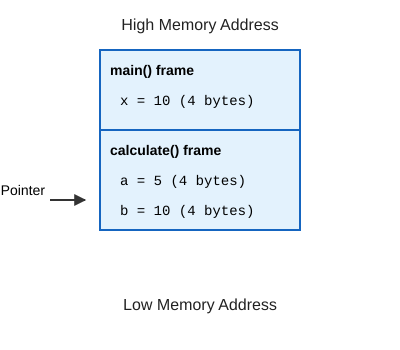
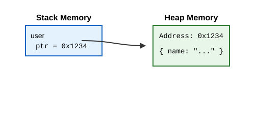

# Prerequisites: Understanding the Machine

Before we dive into Rust, we need to take a step back. As a TypeScript developer, you are used to the V8 engine (or similar JavaScript runtimes) managing the heavy lifting for you. V8 handles memory allocation, cleans up unused objects (Garbage Collection), and compiles your code on the fly (JIT).

Rust doesn't have a runtime engine running alongside your code. It compiles down directly to machine code. To understand Rust—especially its famous "Ownership" model—you need to understand what is happening under the hood. 

This guide covers the fundamental concepts of systems programming that you need to know before writing your first line of Rust.

---

## 1. Computer Memory Overview

At its core, Random Access Memory (RAM) is just a massive, sequential array of **bytes**. Every byte has a unique index, called a **memory address**. 

When you run a compiled program, the operating system gives it a chunk of memory to use. This memory is typically divided into a few distinct segments:
- **Code (Text) Segment**: Where the actual compiled machine instructions live.
- **Data Segment**: Where global and static variables live.
- **The Stack**: Where local variables and function call contexts are stored.
- **The Heap**: Where dynamically allocated data is stored.

For our purposes, we care most about the **Stack** and the **Heap**.

---

## 2. The Stack

The **Stack** is a fast, organized region of memory that operates on a Last-In, First-Out (LIFO) basis—just like a stack of plates. 

When you call a function, the computer creates a **Stack Frame**. This frame contains:
- The function's local variables.
- Arguments passed to the function.
- The return address (where to go back to when the function finishes).

When the function finishes running, its stack frame is "popped" off the stack, and all of its memory is instantly reclaimed. This automatic cleanup makes the stack incredibly fast and efficient.

**The Catch:** To put something on the stack, the compiler *must know its exact size at compile time*. For example, a 32-bit integer always takes up exactly 4 bytes. 

### TypeScript Analogy
In TS, if you write `let x = 5;`, the number `5` is typically stored directly on the stack because it's a simple, fixed-size primitive.

### Stack Frame Diagram




---

## 3. The Heap

The **Heap** is a less organized, massive pool of memory used for data whose size might change, or data that needs to live longer than the function that created it. 

When you need heap memory, you ask the operating system for a certain amount of space. The OS finds a big enough empty spot, marks it as "in use", and hands you back a **pointer** (the memory address of where that spot starts).

**Why is it slower than the stack?**

1. **Allocation overhead:** The OS has to search for contiguous free space.
2. **Pointer chasing:** To get your data, you first go to the stack to get the pointer, and then follow that pointer to the heap.

### TypeScript Analogy
In TS, when you create an object or an array: `const user = { name: "Alice" };`
1. The `{ name: "Alice" }` data is allocated somewhere on the **Heap** (because objects can grow/shrink dynamically).
2. The variable `user` on the **Stack** just holds a *pointer* (reference) to that heap memory.
3. When `user` goes out of scope, the JS Garbage Collector eventually comes around, sees nobody is using that heap memory anymore, and cleans it up.

---

## 4. Pointers and Addresses

A **memory address** is simply an integer representing a location in RAM (e.g., `0x7ffee9b5b5c`). 

A **pointer** is a variable that stores a memory address. 

**Dereferencing** a pointer means saying: "Don't give me the address itself, give me the actual data living *at* that address."

TypeScript doesn't expose pointers to you directly. Everything is a "reference" under the hood. In Rust, you will see pointers and memory addresses directly, and you will explicitly choose when to use a value vs. a reference to a value.




---

## 5. Memory Management Strategies

Every programming language must manage how it uses and cleans up the Heap. There are three main approaches:

1. **Manual Memory Management (C, C++)**
   - **How it works:** You manually call `malloc()` to ask for memory, and `free()` to give it back.
   - **Pros:** Maximum performance and control. No background cleanup tasks.
   - **Cons:** Human error leads to catastrophic bugs:
     - *Memory leaks:* Forgetting to call `free()`.
     - *Use-after-free:* Using a pointer after you've freed the data it points to.
     - *Double-free:* Trying to free the same memory twice.

2. **Garbage Collection (TypeScript, Java, Go, Python)**
   - **How it works:** A background process (the Garbage Collector) periodically scans your program to find heap memory that is no longer being referenced, and automatically cleans it up.
   - **Pros:** Very developer-friendly. Eliminates most memory bugs.
   - **Cons:** Performance overhead. The GC can pause your program randomly to clean up, which is unacceptable for real-time systems or high-performance game engines.

3. **Ownership (Rust)**
   - **How it works:** The compiler strictly tracks who "owns" every piece of data. When the owner goes out of scope, the compiler automatically inserts the cleanup code (`free()`) for you *at compile time*.
   - **Pros:** As fast as C/C++ (no GC runtime overhead), but with 100% memory safety guaranteed by the compiler.
   - **Cons:** The compiler is extremely strict. You have to write code that proves to the compiler that your memory usage is safe. This is the famous "Rust learning curve."

---

## 6. Value Types vs Reference Types

In TypeScript:
- **Primitives** (number, boolean, string) act like **value types**. If you pass `x = 5` to a function, it copies the value `5`. Modifying the argument inside the function doesn't change the original `x`.
- **Objects and Arrays** act like **reference types**. If you pass `obj = { a: 1 }` to a function, you are passing the reference. Modifying `obj.a` inside the function changes the original object.

In Rust, the distinction is different:
- **Copy types:** Simple data (like integers) that live entirely on the stack. Passing them to a function makes a cheap bit-for-bit copy. 
- **Owned types:** Complex data (like Heap-allocated strings or lists). Passing them to a function *moves* ownership. The original variable is no longer allowed to be used! If you just want to let a function *look* at the data without giving away ownership, you pass a explicit **Reference** (borrowing).

---

## 7. Bit and Byte Basics

- **Bit:** A single 0 or 1.
- **Byte:** 8 bits.

When we talk about types in Rust, you will see exactly how many bits they use.
- `i32`: A 32-bit (4 byte) integer.
- `u8`: An 8-bit (1 byte) integer.

**Signed vs Unsigned:**
- **Unsigned (`u`)**: Can only represent positive numbers (and zero). A `u8` goes from 0 to 255.
- **Signed (`i`)**: Can represent negative and positive numbers. An `i8` goes from -128 to 127. Signed integers are typically represented using a format called **Two's Complement**.

**Endianness:**
When storing a multi-byte value (like a 4-byte `i32`) in memory, what order do the bytes go in?
- **Big-Endian:** Most significant byte stored first (like reading English left-to-right).
- **Little-Endian:** Least significant byte stored first. (Most modern CPUs, like x86 and ARM, are little-endian).

**Memory Alignment & Padding:**
CPUs do not read memory one single byte at a time. They read memory in "words" (typically 4 bytes on 32-bit systems, or 8 bytes on 64-bit systems).
- To read a 4-byte integer efficiently, that integer must sit at a memory address that is divisible by 4 (aligned to 4 bytes).
- If a data type starts at an unaligned address, the CPU may have to perform two memory reads instead of one, or on some architectures, crash with an alignment fault!
- To prevent this, the compiler automatically inserts empty bytes called **padding** between fields in a struct or enum.

*Example:*
If you have a struct with a `u8` (1 byte) followed by an `i32` (4 bytes):
```text
Memory Offset:  0      1   2   3      4   5   6   7
Content:       [ u8 ] [ PADDING ]    [     i32     ]
```
Even though the data only totals $1 + 4 = 5$ bytes, the struct will take up **8 bytes** in memory due to 3 bytes of padding.

---

## 8. CPU Registers

While RAM (Stack/Heap) is where your data lives, the CPU cannot do math directly in RAM. It has to pull data into **Registers**.

Registers are ultra-fast, tiny storage locations built directly into the CPU chip itself. A CPU only has a handful of them. 

When you write `let c = a + b;`:

1. The CPU loads `a` from the RAM/Cache into Register 1.
2. The CPU loads `b` from the RAM/Cache into Register 2.
3. The CPU's ALU (Arithmetic Logic Unit) adds Register 1 and Register 2, storing the result in Register 3.
4. The CPU stores Register 3 back into RAM at the address for `c`.

Compilers are incredibly smart. If they notice you use a variable frequently, they might just keep it in a register and never write it to the stack at all!

---

## 9. Binary, Compilation, and Linking

**TypeScript's lifecycle:**
1. You write TS (`.ts`).
2. The `tsc` compiler strips the types and emits JavaScript (`.js`).
3. You run `node script.js`. The V8 engine reads the JS, interprets it, and Just-In-Time (JIT) compiles it into machine code while the program is running.

**Rust's lifecycle:**
1. You write Rust (`.rs`).
2. The `rustc` compiler parses your code, rigorously checks types and ownership, and translates it directly into optimized machine code (Ahead-Of-Time or AOT compilation).
3. The linker bundles your machine code with any OS libraries you need.
4. The output is a standalone **Executable Binary** (e.g., an `.exe` on Windows, or just a binary file on Mac/Linux). 

When you run a Rust binary, there is no engine, no interpreter, and no V8. The OS just loads your machine code straight into RAM and tells the CPU to start executing instructions.

---

## 10. Static vs Dynamic Typing

**TypeScript:**
TS has a static type checker, but it is **erased at runtime**. JavaScript is fundamentally dynamically typed. At runtime, objects carry around metadata about what they are, allowing you to do things like `typeof x` or check if a property exists dynamically.

**Rust:**
Rust is statically typed **all the way down**. Types exist purely for the compiler to verify correctness and safety. 
Once compiled into a binary, **types cease to exist**. The CPU doesn't know what a `String` or a `UserStruct` is; it only sees bytes and instructions. Because the Rust compiler proved everything was correct during compilation, the running binary doesn't need to waste time or memory doing dynamic type checks at runtime.
