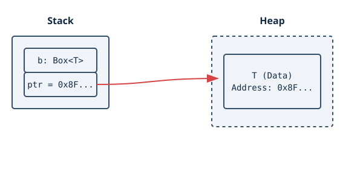
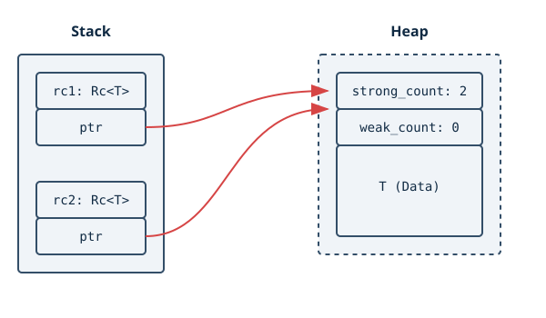
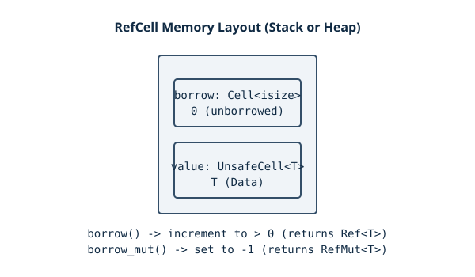
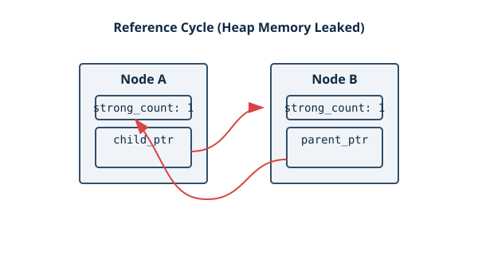

# Smart Pointers in Rust

In TypeScript (running on V8), virtually every object, array, or closure you create is stored on the heap, and your variables are implicitly "smart-ish" pointers to them. The garbage collector tracks these pointers and cleans up the memory when nothing points to it anymore. 

In Rust, **you** choose exactly how your data is stored and how it is cleaned up. This gives you predictable performance and absolute control, but it requires understanding **Smart Pointers**.

## 1. What Are Smart Pointers?

A **pointer** is a general concept for a variable that contains an address in memory.
In Rust, the most common kind of pointer is a **reference** (like `&T` or `&mut T`). References only *borrow* data they point to. They don't own the data, and they have no special capabilities other than pointing to memory.

**Smart Pointers**, on the other hand, are data structures that act like a pointer but have additional metadata and extra capabilities. Crucially, in many cases, smart pointers **own** the data they point to.

Two fundamental traits make a Rust struct behave like a smart pointer:
1.  **`Deref` trait**: Allows instances of the smart pointer struct to behave like references. This means you can use the `*` (dereference) operator on them, and you can write code that works with either normal references or smart pointers seamlessly.
2.  **`Drop` trait**: Allows you to customize the code that is run when an instance of the smart pointer goes out of scope. This is what enables automatic memory cleanup (freeing heap memory, closing file handles or network sockets, etc.).

---

## 2. Using `Box<T>` to Point to Data on the Heap

The most straightforward smart pointer is `Box<T>`. Its sole purpose is to allow you to store data on the **heap** rather than the stack.

### When to use `Box<T>`
- **Large allocations**: When you have a large amount of data (e.g., a massive array) and you want to transfer ownership without copying all that data across the stack.
- **Trait objects**: When you have a value that implements a trait, but you don't know its exact concrete type at compile time (`Box<dyn Trait>`).
- **Recursive types**: When you have a type whose size can't be known at compile time because it contains a value of the same type within it.

### Memory Layout
Behind the scenes, a `Box<T>` is just a standard pointer on the stack that points to an allocation on the heap. On a 64-bit architecture, the `Box` itself only takes up 8 bytes on the stack, no matter how large the heap data `T` is.



### Recursive Types and the Cons List
At compile time, Rust needs to know exactly how much space every type takes up on the stack. Consider a recursive enum like a "cons list" (a functional programming linked list):

```rust
// THIS WILL NOT COMPILE!
enum List {
    Cons(i32, List),
    Nil,
}
```
If Rust tries to determine the size of `List`, it says: "A `List` is an `i32` plus another `List`. That other `List` is an `i32` plus another `List`..." The size is theoretically infinite ($O(\infty)$).

By wrapping the recursive part in a `Box`, we fix the size:
```rust
enum List {
    Cons(i32, Box<List>),
    Nil,
}
```
Now Rust knows the size of `Cons` is the size of an `i32` (4 bytes) + the size of a `Box` pointer (8 bytes). The actual subsequent `List` nodes live on the heap.

### Stable Methods on `Box<T>`
Here is how `Box` interacts with memory:

- `Box::new(x)`: Allocates memory on the heap via the global allocator and *moves* the value `x` from the stack into that heap buffer.
- `Box::into_raw(b)`: Consumes the `Box` (taking ownership) and returns a raw pointer (`*mut T`). **Behind the scenes:** it prevents the `Drop` trait from running, meaning the heap memory is NOT freed. It's up to you to free it later.
- `Box::from_raw(raw)`: Reconstructs a `Box<T>` from a raw pointer. **Behind the scenes:** it wraps the pointer back in a `Box`, meaning the `Drop` trait will run and free the memory when the `Box` goes out of scope. You are taking back ownership.
- `Box::leak(b)`: Intentionally leaks the allocation. It consumes the `Box` and returns a mutable reference that lives for the entire life of the program: `&'static mut T`. **Behind the scenes:** useful for creating static configurations at runtime that you never intend to clean up.

---

## 3. The `Deref` Trait and Deref Coercion

To make a custom smart pointer behave like a regular reference, it must implement `std::ops::Deref`.

```rust
use std::ops::Deref;

struct MyBox<T>(T);

impl<T> Deref for MyBox<T> {
    type Target = T; // The type we dereference into

    fn deref(&self) -> &Self::Target {
        &self.0 // Return a reference to the inner value
    }
}
```

### Behind the Scenes of the `*` Operator
When you write `*y` in Rust, the compiler actually translates it to:
```rust
*(y.deref())
```
Rust calls the `deref` method to get a normal reference, and then uses the built-in `*` operator to dereference that normal reference.

### Deref Coercion
**Deref coercion** is a massive convenience feature. It converts a reference to a type that implements `Deref` into a reference to another type. 

For example, `String` implements `Deref<Target=str>`.
If you have a function `fn hello(name: &str)`, you can pass a `&String` to it. Rust automatically calls `.deref()` at compile time: `&String` -> `&str`.

This can chain! If you pass `&MyBox<String>`, Rust does: `&MyBox<String>` -> `&String` -> `&str`. This all happens at compile time with **zero runtime penalty**.

### Mutability Rules
Rust does deref coercion in three cases:
1. From `&T` to `&U` when `T: Deref<Target=U>`
2. From `&mut T` to `&mut U` when `T: DerefMut<Target=U>`
3. From `&mut T` to `&U` when `T: Deref<Target=U>` (Mutable to Immutable is safe, but Immutable to Mutable is forbidden).

---

## 4. The `Drop` Trait

The `Drop` trait is Rust's version of the **RAII** pattern (Resource Acquisition Is Initialization). It lets you specify what happens when a value is about to go out of scope.

```rust
struct CustomSmartPointer {
    data: String,
}

impl Drop for CustomSmartPointer {
    fn drop(&mut self) {
        println!("Dropping CustomSmartPointer with data `{}`!", self.data);
    }
}
```

### Behind the Scenes
When a variable goes out of scope, the compiler automatically inserts the call to the `drop` method. Variables are dropped in the **reverse order** of their creation (LIFO - Last In, First Out), matching how the stack unwinds.

### Dropping Early
Sometimes you want to free a lock or close a file early. However, you are **not allowed** to call `x.drop()` explicitly. If you did, Rust would still call it again automatically at the end of the scope, resulting in a "double-free" error (a critical memory safety vulnerability).

Instead, you use `std::mem::drop(x)`.
**How it works:** `std::mem::drop` is literally just an empty function that takes ownership of its argument by value:
```rust
pub fn drop<T>(_x: T) {}
```
Because it takes `x` by value, ownership is moved into the `drop` function. When the `drop` function immediately ends, `x` goes out of scope and its `Drop` implementation is triggered automatically!

---

## 5. `Rc<T>`: The Reference Counted Smart Pointer

In TypeScript, multiple variables can easily point to the same object. In Rust, ownership rules dictate a single owner. But what if you represent a graph structure where multiple nodes point to the same child node?

Enter `Rc<T>` (Reference Counted). It enables multiple owners of the same data. Note: `Rc<T>` is strictly for **single-threaded** scenarios.

### Memory Layout
When you create an `Rc<T>`, the heap allocation stores three things:
1. The actual data `T`.
2. A `strong_count` (integer).
3. A `weak_count` (integer).

The stack variable `Rc<T>` is just an 8-byte pointer to this entire heap block.



### Cloning is Cheap!
When you call `Rc::clone(&rc)`, **it does not deep-copy the heap data**. It merely increments the `strong_count` by 1 and returns a new stack pointer pointing to the exact same heap block. This is extremely cheap ($O(1)$ runtime).
When an `Rc` goes out of scope, it decrements the `strong_count`. The heap memory is only actually freed when `strong_count` reaches 0.

### Stable Methods on `Rc<T>`
- `Rc::new(val)`: Allocates the heap block, sets strong=1, weak=0, and moves `val` into it.
- `Rc::clone(&rc)`: Increments `strong_count`.
- `Rc::strong_count(&rc)`: Returns the current strong reference count.
- `Rc::try_unwrap(rc)`: If `strong_count` is 1, returns `Ok(T)`, moving the data out of the heap back to the stack. Otherwise, returns `Err(Rc<T>)`.
- `Rc::get_mut(&mut rc)`: Returns an `Option<&mut T>`. It only returns `Some` if there are no other `Rc` or `Weak` pointers to the same allocation (i.e., strong count is exactly 1). This ensures safe mutation.

---

## 6. `RefCell<T>` and the Interior Mutability Pattern

Rust's borrow checker enforces a strict rule: you can have either one mutable reference (`&mut T`) OR any number of immutable references (`&T`), but never both. 
But sometimes, you need to mutate a value even when you only have an immutable reference to it. This is the **Interior Mutability** pattern.

`RefCell<T>` allows this by moving the borrow checker rules from **compile time** to **runtime**.

- Normal references: Borrow rules checked at **compile time**. Zero runtime cost.
- `RefCell<T>`: Borrow rules checked at **runtime**. Incurs a small performance overhead. If you violate the rules, the program **panics** (crashes).

### Memory Layout
`RefCell<T>` wraps `T` and maintains an internal integer counter called a `borrow` flag (using a `Cell<isize>` internally).
- `0` = unborrowed
- `> 0` = number of active immutable borrows
- `-1` = exactly one active mutable borrow



### `borrow()` vs `borrow_mut()`
- `rc.borrow()`: Checks if counter is `-1` (mutably borrowed). If so, it panics! Otherwise, it increments the counter and returns a smart pointer called `Ref<T>`. When `Ref<T>` goes out of scope (is dropped), it decrements the counter.
- `rc.borrow_mut()`: Checks if counter is `0` (unborrowed). If it is anything else, it panics! Otherwise, it sets the counter to `-1` and returns a `RefMut<T>`. When dropped, resets counter to `0`.

### Combining `Rc<T>` and `RefCell<T>`
A common pattern in Rust is `Rc<RefCell<T>>`.
`Rc` allows **multiple owners**.
`RefCell` allows **mutation**.
Together, they mimic JavaScript/TypeScript object semantics: multiple variables can reference the same object and modify its internal state. However, the runtime borrow checker ensures you don't accidentally create race conditions or data races even in this single-threaded context.

---

## 7. Reference Cycles and Memory Leaks (`Weak<T>`)

Because `Rc` uses reference counting, it is possible to create **memory leaks** in Rust. If you have two `Rc` allocations that point to each other, their `strong_count` will never reach 0, even after all variables on the stack have gone out of scope.



### Preventing Cycles with `Weak<T>`
To prevent cycles, you can use `Weak<T>`. A `Weak<T>` pointer acts like an `Rc<T>`, but calling `Rc::downgrade(&rc)` creates a `Weak<T>` which increments the `weak_count`, not the `strong_count`.

Crucially, the `Drop` implementation for `Rc` only checks if the `strong_count` is 0 to free the data `T`. It does not care about the `weak_count`.

Because the data might have already been dropped while a `Weak<T>` still points to it, you cannot use a `Weak<T>` directly. You must call `weak.upgrade()`, which returns an `Option<Rc<T>>`. If the data was already freed, it returns `None`.

---

## 8. Summary Comparison Table

| Smart Pointer | Allocation | Ownership | Mutability Check | Primary Use Case |
| :--- | :--- | :--- | :--- | :--- |
| `Box<T>` | Heap | Single | Compile-time | Large data, recursive types, trait objects. |
| `Rc<T>` | Heap | Multiple | Compile-time (Immutable only) | Shared ownership (graph nodes), single-threaded. |
| `RefCell<T>` | Same as wrapper | Single | Runtime | Mutating data through an immutable reference. |
| `Rc<RefCell<T>>`| Heap | Multiple | Runtime | Shared ownership + Mutability (JS/TS style). |

---
## References
file:///Users/codingsimba/.rustup/toolchains/stable-x86_64-apple-darwin/share/doc/rust/html/book/ch15-00-smart-pointers.html
file:///Users/codingsimba/.rustup/toolchains/stable-x86_64-apple-darwin/share/doc/rust/html/book/ch15-01-box.html
file:///Users/codingsimba/.rustup/toolchains/stable-x86_64-apple-darwin/share/doc/rust/html/book/ch15-02-deref.html
file:///Users/codingsimba/.rustup/toolchains/stable-x86_64-apple-darwin/share/doc/rust/html/book/ch15-03-drop.html
file:///Users/codingsimba/.rustup/toolchains/stable-x86_64-apple-darwin/share/doc/rust/html/book/ch15-04-rc.html
file:///Users/codingsimba/.rustup/toolchains/stable-x86_64-apple-darwin/share/doc/rust/html/book/ch15-05-interior-mutability.html
file:///Users/codingsimba/.rustup/toolchains/stable-x86_64-apple-darwin/share/doc/rust/html/book/ch15-06-reference-cycles.html
