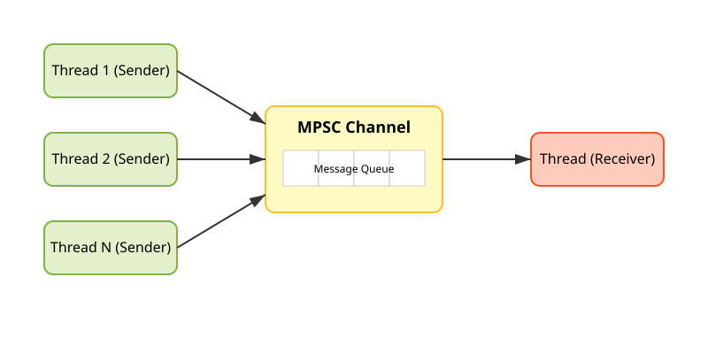
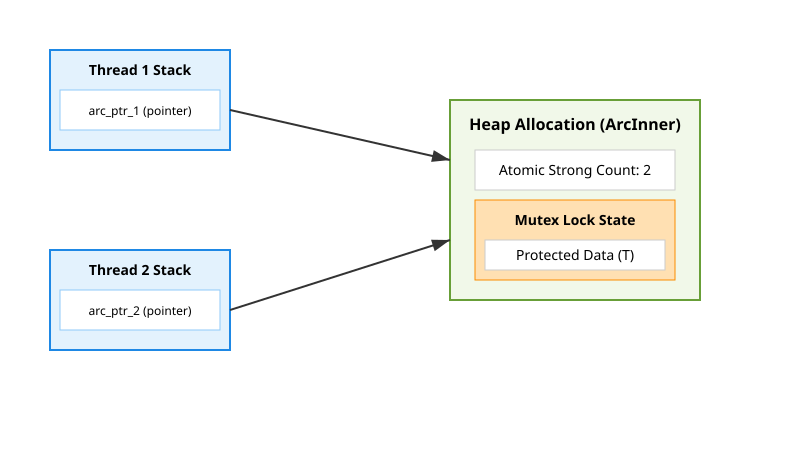

# Fearless Concurrency

In TypeScript and JavaScript, you deal with asynchronous operations through a **single-threaded event loop** (powered by V8). While Node.js provides `worker_threads` and browsers have Web Workers, they communicate primarily via serialization and message passing because sharing memory safely is notoriously difficult.

In Rust, you have access to real, native **operating system (1:1) threads**. Concurrency in C and C++ has historically been a nightmare—haunted by data races, race conditions, deadlocks, and uninitialized memory. Rust calls its concurrency model **"Fearless Concurrency"** because the compiler leverages its ownership and type system to catch 100% of data races at compile time. If your concurrent code compiles, it is guaranteed to be free of data races.

---

## 1. Concurrency vs. Parallelism

- **Concurrency**: Managing multiple computations simultaneously (e.g. your web server handling 10,000 idle socket connections by interleaving their execution).
- **Parallelism**: Executing multiple computations at the exact same physical instant across multiple CPU cores.
- **Thread Models**:
  - **1:1 (OS Threads)**: One language thread maps directly to one operating system kernel thread. Rust uses this model by default for predictable performance and zero runtime overhead.
  - **M:N (Green Threads)**: Many user-space threads mapped onto fewer OS threads (like Go goroutines). Rust delegates this to userland async runtimes like Tokio (covered in Chapter 17).

---

## 2. Using Threads to Run Code Simultaneously

### Spawning a Thread
To create a new thread, call `thread::spawn` and pass a closure containing the code you want to run:

```rust
use std::thread;
use std::time::Duration;

fn main() {
    let handle = thread::spawn(|| {
        for i in 1..10 {
            println!("Hi number {} from the spawned thread!", i);
            thread::sleep(Duration::from_millis(1));
        }
    });

    for i in 1..5 {
        println!("Hi number {} from the main thread!", i);
        thread::sleep(Duration::from_millis(1));
    }

    // Wait for the spawned thread to finish!
    handle.join().unwrap();
}
```

### Waiting for Threads to Finish with `join()`
When the `main` thread of a Rust binary terminates, the entire process exits, stopping all spawned threads regardless of whether they have finished their work.
- `thread::spawn` returns a `JoinHandle<T>`, an owned value representing the thread's execution.
- Calling `handle.join()` **blocks** the current thread until the spawned thread completes its execution.
- `join()` returns a `Result<T, Box<dyn Any + Send>>`. If the spawned thread panicked, `join()` returns an `Err` containing the panic payload.

### The `move` Keyword with Threads
If you attempt to use variables from the environment inside a spawned thread, the compiler will reject it:

```rust
let v = vec![1, 2, 3];

// ERROR: closure may outlive the current function, but it borrows `v`,
// which is owned by the current function!
let handle = thread::spawn(|| {
    println!("Here's a vector: {:?}", v);
});
```

**Why does this happen behind the scenes?**
Rust cannot know how long the spawned thread will run. If the main thread's function returns, its stack frame is popped, and `v` is dropped. If the spawned thread then tried to read `v`, it would read deallocated memory (a dangling pointer).

To fix this, use the `move` keyword before the closure:
```rust
let v = vec![1, 2, 3];

let handle = thread::spawn(move || {
    println!("Here's a vector: {:?}", v);
});
```
`move` forces the closure to **take ownership** of `v`, transferring its 24 bytes (`ptr`, `len`, `cap`) from the main thread's stack frame into the new thread's stack frame. The main thread can no longer access `v`.

---

## 3. Message Passing: Channels (MPSC)

An increasingly popular approach to ensuring safe concurrency is **message passing**, where threads communicate by sending each other data. The famous Go slogan encapsulates this: *"Do not communicate by sharing memory; instead, share memory by communicating."*

Rust's standard library provides **MPSC channels** (**M**ultiple **P**roducer, **S**ingle **C**onsumer).



```rust
use std::sync::mpsc;
use std::thread;

fn main() {
    // tx = transmitter (sender), rx = receiver
    let (tx, rx) = mpsc::channel();

    thread::spawn(move || {
        let val = String::from("hi");
        tx.send(val).unwrap();
        // val cannot be used here! Ownership was moved into the channel!
    });

    let received = rx.recv().unwrap();
    println!("Got: {}", received);
}
```

### Key Properties & Methods of Channels:

#### 1. Ownership Transfer
When you call `tx.send(val)`, ownership of `val` is moved out of the sending thread and into the channel buffer. When the receiver calls `rx.recv()`, it receives ownership of that exact data. This prevents data races because the sender can never accidentally modify `val` after sending it!

#### 2. Methods on `Sender<T>`:
- `send(val: T) -> Result<(), SendError<T>>`: Sends `val` down the channel. Fails only if the receiver `rx` has already been dropped.
- `tx.clone()`: You can clone the transmitter as many times as you want to allow multiple threads to send to the same single receiver.

#### 3. Methods on `Receiver<T>`:
- `recv() -> Result<T, RecvError>`: Blocks the calling thread until a value is sent. If all transmitters (`Sender`s) have been dropped, `recv()` returns `Err` to signal that no more messages will ever arrive.
- `try_recv() -> Result<T, TryRecvError>`: Non-blocking check. Returns `Ok(val)` if a message is waiting, or `Err(TryRecvError::Empty)` if none are ready yet. Useful in UI or game loops where a thread cannot afford to block.
- Iterating over `rx`:
  ```rust
  for msg in rx {
      println!("Received: {}", msg);
  }
  ```
  The `for` loop repeatedly calls `recv()` and cleanly exits when all senders drop.

#### 4. Asynchronous vs. Synchronous Channels:
- `mpsc::channel()`: Creates an **unbounded asynchronous channel**. Senders never block; they push into an infinite heap-allocated buffer.
- `mpsc::sync_channel(bound)`: Creates a **bounded synchronous channel**. If the buffer reaches `bound` items, subsequent `send()` calls will **block** the sender until the receiver pulls an item out. This provides backpressure to prevent producers from overwhelming consumer memory.

---

## 4. Shared-State Concurrency: `Mutex<T>` and `Arc<T>`

While message passing is clean, some problems require multiple threads to read and write the exact same shared memory. Rust makes shared state safe by combining two types: `Mutex<T>` and `Arc<T>`.



### Mutual Exclusion with `Mutex<T>`
A **Mutex** ("mutual exclusion") guards access to data by allowing only one thread to access it at any given time.

In C/C++ or Go, a mutex is a separate object that sits beside your data:
```c
// Dangerous C pseudo-code:
pthread_mutex_lock(&lock);
data += 1; // Easy to forget the lock, or forget to unlock!
pthread_mutex_unlock(&lock);
```

In Rust, **the Mutex owns the data**: `Mutex<T>`. You cannot touch `T` without locking the mutex:

```rust
use std::sync::Mutex;

fn main() {
    let m = Mutex::new(5);

    {
        // lock() blocks until the lock is acquired
        let mut num = m.lock().unwrap();
        *num = 6; // num is a MutexGuard<i32> that dereferences to i32
    } // RAII: num goes out of scope here; the lock is AUTOMATICALLY released!

    println!("m = {:?}", m);
}
```

### The Magic of `MutexGuard<T>`
When you call `m.lock().unwrap()`, it returns a `MutexGuard<T>`. This type implements:
1. `Deref<Target = T>`: Lets you treat the guard as a reference to the inner data `*num = 6`.
2. `Drop`: When the guard leaves its scope, its `drop` implementation executes, which automatically calls the OS unlock primitive (e.g. `pthread_mutex_unlock` or Windows `ReleaseMutex`). **You can never forget to unlock a mutex in Rust.**

### Why `Rc<T>` Fails Across Threads
If you try to wrap a `Mutex` in a standard `Rc<T>` to share it across threads:
```rust
let counter = Rc::new(Mutex::new(0));
let c = Rc::clone(&counter);
thread::spawn(move || { ... }); // ERROR: `Rc<Mutex<i32>>` cannot be sent between threads safely!
```

**Why?**
`Rc<T>` maintains its reference count using standard non-atomic integers (`count += 1`). If two CPU cores attempt to increment that counter simultaneously, the CPU's read-modify-write cycle can interleave, leading to memory corruption or premature deallocation.

### `Arc<T>`: Atomic Reference Counting
To share reference-counted memory safely across multiple OS threads, Rust provides `Arc<T>` (**A**tomic **R**eference **C**ounting).

`Arc<T>` uses **atomic hardware instructions** (like `LOCK INC` on x86) to increment and decrement the counter. The CPU hardware guarantees that the counter update happens atomically across all cores without interference.

**Why not use `Arc<T>` everywhere?**
Atomic operations require cache-line synchronization across CPU cores, adding a small performance penalty. Rust follows the zero-cost abstraction philosophy: use `Rc<T>` for single-threaded code (zero overhead) and `Arc<T>` when concurrency is required.

### The Canonical Multi-Threaded Counter
Combining `Arc` and `Mutex` gives you thread-safe shared mutable state:

```rust
use std::sync::{Arc, Mutex};
use std::thread;

fn main() {
    let counter = Arc::new(Mutex::new(0));
    let mut handles = vec![];

    for _ in 0..10 {
        let counter_clone = Arc::clone(&counter);
        let handle = thread::spawn(move || {
            let mut num = counter_clone.lock().unwrap();
            *num += 1;
        });
        handles.push(handle);
    }

    for handle in handles {
        handle.join().unwrap();
    }

    println!("Result: {}", *counter.lock().unwrap()); // 10
}
```

---

## 5. Extensible Concurrency with `Sync` and `Send` Traits

Rust does not hardcode concurrency rules into its compiler keywords. Instead, thread safety is built into the type system using two **marker traits** defined in `std::marker`:

### 1. The `Send` Trait
- Indicates that ownership of the type can be transferred across thread boundaries.
- Almost all Rust types are `Send`.
- Notable exceptions that are **NOT `Send`**:
  - `Rc<T>`: transferring it would allow non-atomic reference counter manipulation.
  - Raw pointers (`*const T`, `*mut T`): because they bypass all safety checks.

### 2. The `Sync` Trait
- Indicates that it is safe for multiple threads to access `&T` concurrently.
- In formal terms: **`T` is `Sync` if and only if `&T` is `Send`**.
- Notable exceptions that are **NOT `Sync`**:
  - `RefCell<T>` and `Cell<T>`: their internal borrow flags are not atomic.
  - `Rc<T>`.

### Automatic Trait Derivation
`Send` and `Sync` are auto traits. If every field of a custom struct is `Send` and `Sync`, your struct is automatically `Send` and `Sync` without writing any code. If any field is not (e.g. holding an `Rc`), the compiler prevents your struct from being sent across threads.

---

## 6. Deadlocks vs. Data Races

Rust guarantees the absence of **Data Races** at compile time:
> A data race occurs when two or more pointers access the same memory location concurrently, at least one is writing, and there is no synchronization.

However, Rust cannot prevent logical concurrency bugs such as **Deadlocks**:
- A deadlock occurs when Thread A holds Lock 1 and waits for Lock 2, while Thread B holds Lock 2 and waits for Lock 1. Both threads freeze forever.
- To prevent deadlocks, always acquire locks in a consistent, deterministic order across all threads.

---

## References
file:///Users/codingsimba/.rustup/toolchains/stable-x86_64-apple-darwin/share/doc/rust/html/book/ch16-00-concurrency.html
file:///Users/codingsimba/.rustup/toolchains/stable-x86_64-apple-darwin/share/doc/rust/html/book/ch16-01-threads.html
file:///Users/codingsimba/.rustup/toolchains/stable-x86_64-apple-darwin/share/doc/rust/html/book/ch16-02-message-passing.html
file:///Users/codingsimba/.rustup/toolchains/stable-x86_64-apple-darwin/share/doc/rust/html/book/ch16-03-shared-state.html
file:///Users/codingsimba/.rustup/toolchains/stable-x86_64-apple-darwin/share/doc/rust/html/book/ch16-04-extensible-concurrency-sync-and-send.html
