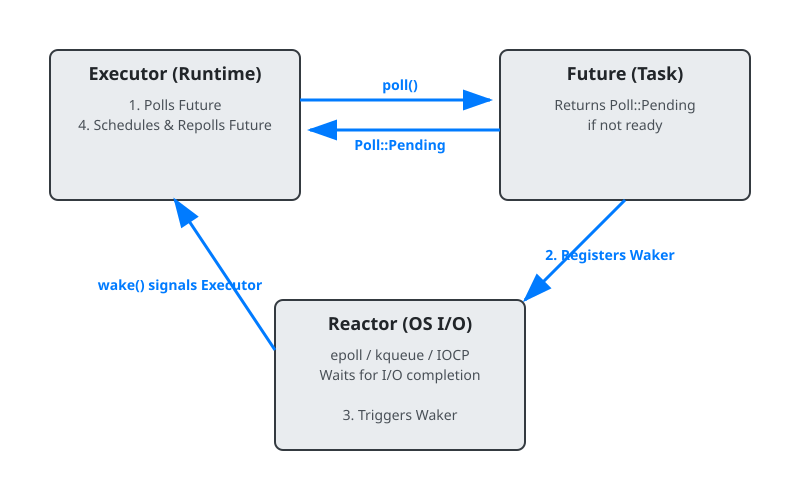
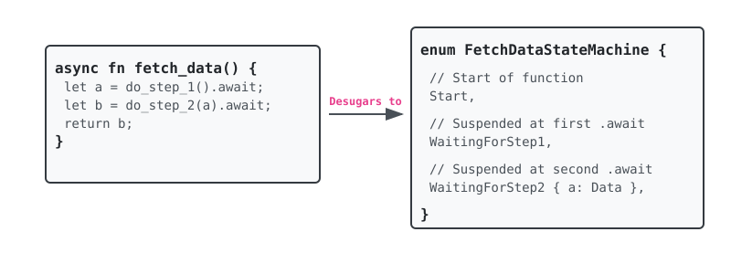

# 17. Asynchronous Programming

## 1. Asynchronous Programming: What and Why?

When dealing with many concurrent operations (like handling thousands of network connections), there are two main approaches:

*   **OS Threads**: Heavyweight. Every thread has its own call stack (usually around 2MB on Linux/macOS) and is scheduled by the operating system. Context switching is relatively slow. Thousands of threads can exhaust memory.
*   **Asynchronous Tasks (Green/Cooperative Multitasking)**: Lightweight. Tasks are scheduled by a user-space "runtime". A task only uses a few bytes (just a struct holding state). You can comfortably run hundreds of thousands of concurrent tasks on a *single* OS thread.

### TypeScript vs Rust Async: The Fundamental Mindset Shift

If you are coming from TypeScript, this is the most critical difference you must understand:

*   **TypeScript/JavaScript (Eager and Push-based):**
    When you call an `async fn` in TypeScript, it **starts running immediately**. The JavaScript engine pushes it onto the microtask queue, and it executes until it hits its first `await`.
    ```typescript
    async function doWork() { console.log("Started!"); }
    doWork(); // "Started!" prints immediately, even without awaiting.
    ```

*   **Rust (Lazy and Pull-based):**
    When you call an `async fn` in Rust, **it does absolutely nothing**. It returns a `Future`, which is just a struct describing the work to be done. The work only happens when you explicitly `poll` it, typically by `.await`ing it inside another running async task, or by handing it to an executor.
    ```rust
    async fn do_work() { println!("Started!"); }
    
    let future = do_work(); // Nothing happens!
    // future.await; // Work happens here!
    ```
    If you don't `.await` a future in Rust, it just sits in memory doing nothing.

---

## 2. The `Future` Trait and How Polling Works

In TypeScript, asynchronous operations revolve around `Promise`. In Rust, the core concept is the `Future` trait:

```rust
pub trait Future {
    type Output;
    fn poll(self: Pin<&mut Self>, cx: &mut Context<'_>) -> Poll<Self::Output>;
}
```

The `poll` method returns an enum `Poll<T>`:
*   `Poll::Ready(value)`: The future has completed and here is its result.
*   `Poll::Pending`: The future is not done yet.

### The Executor & Reactor Pattern

Since Futures are lazy, something needs to actively poll them. This is the job of an async runtime.

1.  **Executor**: The loop that repeatedly calls `poll()` on Futures that are ready to make progress.
2.  **Reactor (OS I/O)**: Listens for events from the operating system (e.g., "data arrived on socket X"). It uses OS primitives like `epoll` on Linux or `kqueue` on macOS.
3.  **Waker**: A callback handle. When a Future returns `Poll::Pending`, it hands a `Waker` to the Reactor.

**The Lifecycle:**
1. The **Executor** polls the Future.
2. The Future is waiting on network I/O, so it registers its **Waker** with the **Reactor** and returns `Poll::Pending`.
3. The Executor puts the task to sleep (stops polling it).
4. The OS tells the **Reactor** the network data is ready.
5. The Reactor calls `waker.wake()`.
6. The `wake()` call signals the **Executor**: "Hey, this task is ready to make progress!"
7. The Executor schedules the task and calls `poll()` again. This time it returns `Poll::Ready(data)`.



---

## 3. `async` / `.await` and Compiler State Machines

What exactly does `async fn` do under the hood?

In Rust, the compiler transforms an `async fn` into an anonymous struct that implements the `Future` trait. This struct is a **State Machine**.

Each `.await` point in your code represents a boundary where execution can pause and resume. The compiler generates an `enum` representing the state of the function at each `.await` point. Any local variables that are needed *across* an `.await` point are stored as fields in this struct.



**Memory impact:** Because all local variables needed across `.await` points are stored inside this struct, a task has a precisely known size at compile time. It can be stored directly on the stack or allocated in one chunk on the heap. This means creating an async task requires **zero heap allocations by default**.

---

## 4. `Pin<T>` and Self-Referential Structs

In TypeScript, you never think about moving objects in memory—the Garbage Collector manages that. In Rust, values can be moved around (e.g., passing a struct by value or pushing it onto a `Vec`).

This creates a massive problem for compiler-generated Future state machines.

Consider a future that holds a local variable `data` and a reference to it `ptr` across an `.await` boundary.

```rust
async fn self_referential() {
    let data = "Hello".to_string();
    let ptr = &data;
    some_io().await; // Suspension point
    println!("{}", ptr);
}
```

The desugared state machine struct contains both `data` and `ptr`. `ptr` points to the memory address of `data` *inside the same struct*.

If the executor moves this Future struct in memory (e.g., from one place in the stack to the heap), the memory address of `data` changes. But `ptr` is still pointing to the *old* address. It is now a dangling pointer, leading to **Undefined Behavior**!

**The Solution: `Pin<T>`**

`Pin<&mut T>` is a wrapper around a pointer that guarantees to the compiler: **"The data at this address will NEVER move again before it is dropped."**

When you write `fn poll(self: Pin<&mut Self>, ...)`, you are ensuring that by the time the future is polled, it is pinned in memory. The self-referential pointers inside the state machine remain valid.

*   `Unpin`: This is a marker trait for types that *can* safely be moved even if pinned (like `i32`, `String`, standard structs). Almost all standard types are `Unpin`.
*   Compiler-generated Future state machines do **not** implement `Unpin`. They are `!Unpin` (not Unpin) and must be carefully pinned before use.

---

## 5. The Async Ecosystem: Language vs Runtime

In Node.js, the V8 engine and libuv provide the async runtime out-of-the-box.
In Go, the goroutine scheduler is built into the standard library.

**Rust is different: The standard library does NOT include an async runtime.**

The standard library only provides the interface: `Future`, `Poll`, `Context`, `Waker`, and `Pin`. It defines *how* futures work, but does not provide the Executor or Reactor to actually run them.

You must bring your own runtime. The most popular community-driven runtimes are:
1.  **Tokio**: The industry standard. Heavy, feature-rich, deeply integrated with OS I/O.
2.  **async-std**: Designed to look exactly like the standard library, but async.
3.  **smol**: A small, fast, flexible runtime.

This is why a typical Rust async binary looks like this:

```rust
#[tokio::main] // This macro starts the Tokio runtime (executor + reactor)
async fn main() {
    println!("Hello from Tokio!");
}
```

---

## 6. Joining, Selecting, and Streams

How do we handle multiple futures concurrently?

### Joining (Like `Promise.all`)
Waits for *all* futures to complete.
```rust
// Requires importing runtime-specific macros, like `tokio::join!`
let (res1, res2) = tokio::join!(task1(), task2());
```

### Selecting (Like `Promise.race`)
Waits for the *first* future to complete. In Rust, because futures do nothing unless polled, when `select!` finishes with one future, it simply drops the other. **Dropping a future cancels it!** There are no dangling callbacks.
```rust
tokio::select! {
    val = do_work() => { println!("Work finished: {}", val); }
    _ = tokio::time::sleep(Duration::from_secs(5)) => { println!("Timeout!"); }
}
```

### Streams (Like `AsyncIterable`)
A `Stream` in Rust is analogous to TypeScript's `AsyncIterator`. Instead of yielding a single value in the future, it yields multiple values over time.

Instead of `Future::poll`, it has `Stream::poll_next`.

```rust
use futures::stream::StreamExt; // Extension trait providing useful methods

async fn process_stream(mut stream: impl Stream<Item = i32> + Unpin) {
    while let Some(item) = stream.next().await {
        println!("Received: {}", item);
    }
}
```

---

## References
file:///Users/codingsimba/.rustup/toolchains/stable-x86_64-apple-darwin/share/doc/rust/html/book/ch17-00-async-await.html
file:///Users/codingsimba/.rustup/toolchains/stable-x86_64-apple-darwin/share/doc/rust/html/book/ch17-01-futures-and-syntax.html
file:///Users/codingsimba/.rustup/toolchains/stable-x86_64-apple-darwin/share/doc/rust/html/book/ch17-02-concurrency-with-async.html
