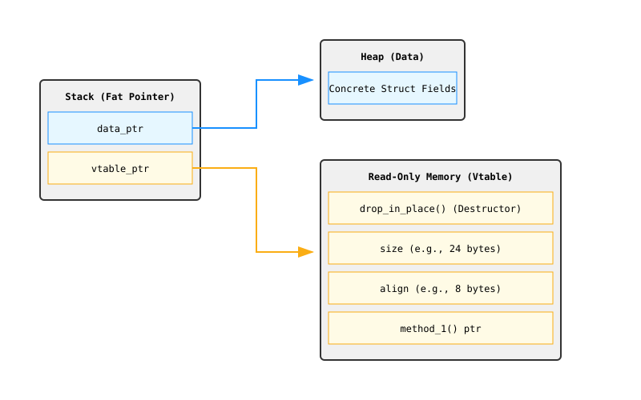

# Object-Oriented Programming Features in Rust

Coming from TypeScript, you're deeply familiar with object-oriented programming (OOP). Classes, inheritance (`extends`), interfaces (`implements`), and polymorphism are the bread and butter of TS. 

Rust is *not* a purely object-oriented language. It is a multi-paradigm language. However, it provides features that allow you to express many OOP patterns, often in ways that are safer, more performant, and explicitly avoid the pitfalls of classical inheritance.

Let's break down how OOP concepts map onto Rust.

## 1. Characteristics of Object-Oriented Programs: Does Rust Have Them?

The defining characteristics of OOP usually boil down to objects, encapsulation, and inheritance. Let's see how Rust stacks up.

### Objects contain data and behavior

In TypeScript, a `class` binds data (properties) and behavior (methods) together into a single entity.

In Rust, data and behavior are decoupled syntactically, but tightly coupled semantically:
- **Structs and Enums** hold the *data*.
- **`impl` blocks** provide the *behavior*.

```rust
// The Data
pub struct Button {
    width: u32,
    height: u32,
    label: String,
}

// The Behavior
impl Button {
    pub fn new(width: u32, height: u32, label: String) -> Self {
        Button { width, height, label }
    }

    pub fn draw(&self) {
        println!("Drawing a button: {}", self.label);
    }
}
```
*Yes, Rust has objects (even if it doesn't have the `class` keyword).*

### Encapsulation

Encapsulation means that the implementation details of an object are hidden from the code using it. You interact with an object through its public API, not its internal data fields.

In TypeScript, you use `private`, `protected`, and `public`. 
In Rust, you use the `pub` keyword to manage visibility across module boundaries. By default, everything in Rust is private.

```rust
pub mod ui {
    pub struct Checkbox {
        pub label: String, // Public field, accessible anywhere
        is_checked: bool,  // Private field, only accessible within the `ui` module
    }

    impl Checkbox {
        pub fn check(&mut self) {
            self.is_checked = true;
        }
        
        // Only internal module code can use this
        fn internal_sync(&self) { /* ... */ }
    }
}
```
*Yes, Rust has encapsulation.*

### Inheritance

In TypeScript, you use `extends` to create a subclass that inherits data fields and methods from a parent class. 

**Rust does NOT have classical class inheritance.** There is no `extends`. A struct cannot inherit fields from another struct.

#### Why Rust rejects classical inheritance
1. **The Fragile Base Class Problem:** Changes in a parent class can unexpectedly break child classes because they are so tightly coupled.
2. **Deep Hierarchies:** Deep inheritance trees make code hard to read and modify (e.g., `Dog` inherits from `Mammal`, which inherits from `Animal`, which inherits from `Organism`).
3. **Data Bloat:** Subclasses inherit all parent fields, even if they only need a subset.

Instead of inheritance, Rust highly favors **composition** (structs containing other structs) and **traits** for sharing behavior.

---

## 2. Using Trait Objects for Heterogeneous Values

In TypeScript, arrays can hold any combination of objects as long as they satisfy an interface.
```typescript
interface Shape {
    draw(): void;
}
class Circle implements Shape { draw() {} }
class Square implements Shape { draw() {} }

// Heterogeneous array
const shapes: Shape[] = [new Circle(), new Square()];
```

In Rust, standard collections like `Vec<T>` are homogeneous—they can only hold *one concrete type* determined at compile time. 
```rust
let shapes: Vec<Circle> = vec![Circle {}, Circle {}]; // OK
// let shapes: Vec<Shape> = vec![Circle {}, Square {}]; // ERROR! Shape is not a concrete size.
```

To store different types that implement the same trait in a collection, you must use **Trait Objects**.

A trait object is a pointer to an instance of a type that implements our trait. You create one by adding the `dyn` (dynamic) keyword to a reference (`&dyn Trait`) or a smart pointer (`Box<dyn Trait>`).

```rust
trait Shape {
    fn draw(&self);
}

struct Circle;
impl Shape for Circle { fn draw(&self) { println!("Circle"); } }

struct Square;
impl Shape for Square { fn draw(&self) { println!("Square"); } }

// Now we can have a heterogeneous collection!
// We use Box because `dyn Shape` doesn't have a known size at compile time.
let shapes: Vec<Box<dyn Shape>> = vec![
    Box::new(Circle),
    Box::new(Square),
];

for shape in shapes {
    shape.draw(); // Dynamic dispatch happens here!
}
```

---

## 3. Static Dispatch vs Dynamic Dispatch (Deep Dive)

When you call a method, how does the CPU know which specific assembly code block to execute?

### Static Dispatch (Monomorphization)
This is what happens when you use generics.

```rust
fn draw_all<T: Shape>(items: &[T]) {
    for item in items {
        item.draw();
    }
}
```
**How it works:**
The compiler looks at everywhere `draw_all` is called. If you call it with an array of `Circle`s and an array of `Square`s, the compiler generates *two completely separate functions* under the hood: `draw_all_circle` and `draw_all_square`.

**Memory & CPU impact:**
- *Pros:* **Zero runtime overhead**. The compiler knows exactly where the function is in memory, allowing for aggressive optimizations like inlining.
- *Cons:* Code bloat (larger binary size because of duplicated functions), and it only works on homogeneous collections.

### Dynamic Dispatch (Trait Objects)
This is what happens when you use `dyn Trait`.

```rust
fn draw_all(items: &[Box<dyn Shape>]) {
    for item in items {
        item.draw();
    }
}
```
**How it works:**
The compiler doesn't know the concrete type at compile time. Instead, it emits a **Fat Pointer**. 

A standard pointer is 8 bytes (on a 64-bit system). A trait object fat pointer is **16 bytes**. It consists of:
1. **`data_ptr` (8 bytes):** A pointer to the actual struct data on the heap (or stack if it's a `&dyn`).
2. **`vtable_ptr` (8 bytes):** A pointer to a Virtual Method Table (vtable).

The **vtable** is a static block of read-only memory generated by the compiler for each concrete type that implements the trait. It contains:
- `drop_in_place`: A pointer to the destructor to clean up the specific type.
- `size`: The size of the concrete type in bytes.
- `align`: The memory alignment requirement for the concrete type.
- Function pointers for every method in the trait.



**Memory & CPU impact:**
- *Pros:* Allows for heterogeneous collections and flexible runtime polymorphism (like TypeScript interfaces).
- *Cons:* Indirection overhead. To call `.draw()`, the CPU must follow the fat pointer to the vtable, look up the function pointer for `draw`, and *then* jump to that assembly code. This pointer chasing prevents the compiler from inlining the function call.

---

## 4. Object Safety: Which Traits Can Be Trait Objects?

In TypeScript, any interface can be used as a type.
In Rust, **not all traits can be turned into `dyn Trait`!** A trait must be "Object Safe".

A trait is object safe if all its methods follow these two strict rules:
1. **The return type isn't `Self`.**
2. **The method has no generic type parameters.**

#### Why can't a trait object return `Self`?
`Self` refers to the concrete type (e.g., `Circle` or `Square`). But if you have a `Box<dyn Clone>` and call `.clone() -> Self`, what is it returning? The caller needs to know exactly how many bytes to allocate on the stack for the return value. But `dyn Clone` hides the original type! It could be a 1-byte struct or a 1000-byte struct. Because the compiler can't know the size, it refuses to compile.

#### Why can't a trait object have generic methods?
If a trait method has a generic type `T`, the compiler generates a unique vtable entry for every concrete type `T` you ever call that method with (monomorphization). But dynamic dispatch happens at *runtime*. The compiler would theoretically need an infinite number of vtable entries for every possible generic type that *could* be used.

---

## 5. Implementing an Object-Oriented Design Pattern (State Pattern)

Let's look at how OOP patterns translate to Rust, specifically the State Pattern. 
Scenario: A blog post transitions from `Draft` -> `Pending Review` -> `Published`.

### The Traditional OOP Approach (Trait Objects)
You could implement this using trait objects, just like you would with classes in TypeScript.

```rust
pub struct Post {
    state: Option<Box<dyn State>>,
    content: String,
}

trait State {
    fn request_review(self: Box<Self>) -> Box<dyn State>;
    fn approve(self: Box<Self>) -> Box<dyn State>;
    fn content<'a>(&self, post: &'a Post) -> &'a str { "" }
}

struct Draft {}
impl State for Draft {
    fn request_review(self: Box<Self>) -> Box<dyn State> { Box::new(PendingReview {}) }
    fn approve(self: Box<Self>) -> Box<dyn State> { self } // Can't approve a draft
}
// ... implementations for PendingReview and Published
```
*Problem:* This requires heap allocations (`Box`) and dynamic dispatch (vtables). Furthermore, a developer could mistakenly call `post.approve()` on a `Draft` at runtime; the state object handles it by doing nothing, but the mistake isn't caught until the program is running.

### The Idiomatic Rust Alternative: The Type-State Pattern
In Rust, it's far better to encode the state directly into the type system.

Instead of one `Post` struct holding a dynamic state, we create distinct, concrete types for each state. State transitions are methods that take ownership of `self` (consuming the old type) and return a new instance of the new type.

```rust
pub struct DraftPost {
    content: String,
}

pub struct PendingReviewPost {
    content: String,
}

pub struct PublishedPost {
    content: String,
}

impl DraftPost {
    pub fn new() -> Self { DraftPost { content: String::new() } }
    pub fn add_text(&mut self, text: &str) { self.content.push_str(text); }
    
    // Consumes DraftPost, returns PendingReviewPost
    pub fn request_review(self) -> PendingReviewPost {
        PendingReviewPost { content: self.content }
    }
}

impl PendingReviewPost {
    // Consumes PendingReviewPost, returns PublishedPost
    pub fn approve(self) -> PublishedPost {
        PublishedPost { content: self.content }
    }
}

impl PublishedPost {
    pub fn content(&self) -> &str {
        &self.content
    }
}
```

**Why Type-State is superior:**
1. **Compile-Time Safety:** It is literally impossible to call `.approve()` on a `DraftPost`. The compiler will reject it because `DraftPost` doesn't have an `approve` method. Invalid state transitions are caught before you even run the code.
2. **Zero Runtime Overhead:** No `Box`, no heap allocation, no `dyn`, no vtable lookups. It is incredibly fast.
3. **Data Protection:** You cannot read the content of a draft or pending post, because only `PublishedPost` implements the `.content()` method!

Rust allows you to build APIs where it's impossible for the consumer to use them incorrectly.

## References
file:///Users/codingsimba/.rustup/toolchains/stable-x86_64-apple-darwin/share/doc/rust/html/book/ch18-00-oop.html
file:///Users/codingsimba/.rustup/toolchains/stable-x86_64-apple-darwin/share/doc/rust/html/book/ch18-01-what-is-oo.html
file:///Users/codingsimba/.rustup/toolchains/stable-x86_64-apple-darwin/share/doc/rust/html/book/ch18-02-trait-objects.html
file:///Users/codingsimba/.rustup/toolchains/stable-x86_64-apple-darwin/share/doc/rust/html/book/ch18-03-oo-design-patterns.html
