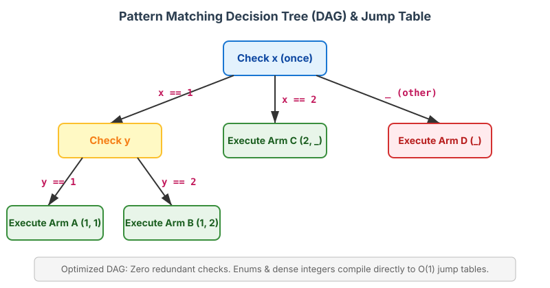

# Patterns and Matching in Rust

If you're coming from TypeScript, you are already familiar with destructuring (`const { a, b } = obj`, `const [first, ...rest] = arr`) and the `switch` statement. In Rust, these concepts are combined and amplified into **patterns**. Patterns in Rust are a special syntax for matching against the structure of types, both simple and complex. 

Combining patterns with `match` expressions and other constructs gives you an expressive way to ensure your code handles all possible data shapes, with the compiler enforcing exhaustiveness.

---

## 1. All the Places Patterns Can Be Used in Rust

You might think patterns only belong in a `match` expression, but they are woven throughout the entire Rust language.

### `match` Arms
The most common place for patterns is in the arms of a `match` expression, functioning like a super-powered TypeScript `switch`.

```rust
enum Direction { North, South, East, West }

let dir = Direction::North;
match dir {
    Direction::North => println!("Heading North!"),
    Direction::South | Direction::East | Direction::West => println!("Not North"),
}
```
*Compiler magic:* Unlike a TS `switch`, a Rust `match` **must be exhaustive**. The compiler guarantees you've handled every possible variant.

### Conditional `if let` and `while let` Expressions
Sometimes you only care about one specific pattern and want to ignore the rest. `if let` is syntactic sugar for a `match` that handles one case and ignores the rest.

```rust
let some_value = Some(5);

// Only runs if the pattern `Some(x)` matches `some_value`
if let Some(x) = some_value {
    println!("Got an inner value: {}", x);
}

// `while let` runs the loop as long as the pattern continues to match
let mut stack = vec![1, 2, 3];
while let Some(top) = stack.pop() {
    println!("Popped: {}", top);
}
```

### `for` Loops
The value right after the `for` keyword is a pattern! 

```rust
let v = vec!['a', 'b', 'c'];

// (index, value) is a tuple pattern matching the output of `.enumerate()`
for (index, value) in v.iter().enumerate() {
    println!("{} is at index {}", value, index);
}
```

### `let` Statements
Every time you use `let`, you are actually using a pattern!
```rust
// The pattern here is the variable name `x`, which matches anything.
let x = 5; 

// A tuple pattern destructing a tuple value!
let (x, y, z) = (1, 2, 3);
```

### Function Parameters
Just like TS function destructuring (`function printCoords({ x, y }: Point)`), you can destruct in Rust function signatures.

```rust
// Destructuring a tuple reference in the parameter list
fn print_coordinates(&(x, y): &(i32, i32)) {
    println!("Current location: ({}, {})", x, y);
}

let point = (3, 5);
print_coordinates(&point);
```

---

## 2. Refutability: Whether a Pattern Might Fail to Match

Patterns come in two flavors: **irrefutable** (cannot fail) and **refutable** (can fail).

### Irrefutable Patterns
Irrefutable patterns will match for *any* possible value passed to them. 

*   `let x = 5;`: `x` matches anything. It cannot fail.
*   `let Point { x, y } = p;`: If `p` is a `Point`, it will always have `x` and `y`.

### Refutable Patterns
Refutable patterns can fail to match for some possible values.

*   `if let Some(x) = value`: If `value` is `None`, the `Some(x)` pattern fails to match.
*   `match coin { Coin::Penny => ... }`: `Coin::Penny` is refutable because `coin` could be `Coin::Dime`.

### Compiler Rules for Refutability
The compiler enforces where these types of patterns can live:
1.  **`let`, `for`, and function parameters MUST be irrefutable.** (Because if they fail, the program doesn't know what to do next).
    *   *Error:* `let Some(x) = some_option_value;` (Fails to compile because `None` isn't handled).
2.  **`if let` and `while let` are designed for refutable patterns.**
    *   *Warning:* `if let x = 5 { ... }` (The compiler warns you because `x` never fails, so an `if let` is useless here; just use a standard `let`).

---

## 3. Pattern Syntax In-Depth

### Matching Literals and Variables
```rust
let x = 1;

match x {
    1 => println!("one"),
    2 => println!("two"),
    _ => println!("anything"), // `_` is a catch-all pattern
}
```

**Variable Shadowing in Match Arms:**
Be careful when introducing variables inside a `match` arm. They shadow variables outside the `match`.
```rust
let x = Some(5);
let y = 10;

match x {
    Some(50) => println!("Got 50"),
    Some(y) => println!("Matched, y = {y}"), // THIS IS A NEW `y`! It binds to 5, shadowing the outer 10.
    _ => println!("Default case, x = {:?}", x),
}
```

### Multiple Patterns (`|`) and Ranges (`..=`)
You can match multiple values using the pipe `|` (OR) operator, or ranges of values using `..=`. Ranges only work with numbers and `char`s.

```rust
let x = 3;
match x {
    1 | 2 => println!("one or two"),
    3..=5 => println!("three through five"), // Matches 3, 4, or 5
    _ => println!("something else"),
}

let c = 'c';
match c {
    'a'..='j' => println!("early ASCII letter"),
    'k'..='z' => println!("late ASCII letter"),
    _ => println!("something else"),
}
```

### Destructuring Structs, Enums, and Tuples

**Structs:**
```rust
struct Point { x: i32, y: i32 }
let p = Point { x: 0, y: 7 };

// Destructuring with field shorthand
let Point { x, y } = p; 

// Destructuring with renaming (like TS `const { x: a, y: b } = p`)
let Point { x: a, y: b } = p; 
```

**Enums & Nested Data:**
```rust
enum Message {
    Quit,
    Move { x: i32, y: i32 },
    Write(String),
    ChangeColor(i32, i32, i32),
}

let msg = Message::ChangeColor(0, 160, 255);

match msg {
    Message::Quit => println!("Quit has no data to destructure."),
    Message::Move { x, y } => println!("Move to x: {x} y: {y}"),
    Message::Write(text) => println!("Text message: {text}"),
    Message::ChangeColor(r, g, b) => println!("Color RGB: {r},{g},{b}"),
}
```

### Ignoring Values
Sometimes you don't need all the data in a pattern.

*   **`_` (Ignore entirely):** `Some(_)` means "I care that it's a `Some`, but I don't care what's inside."
*   **`_name` (Suppress unused warnings):** Prefixing a variable with an underscore like `_x` binds the value, but tells the compiler "I know I'm not using this, don't warn me." (Note: this still takes ownership, unlike `_` which completely ignores the value!).
*   **`..` (Ignore remaining parts):** Useful for large structs or tuples.
    ```rust
    let p = Point3D { x: 0, y: 1, z: 2 };
    let Point3D { x, .. } = p; // Ignores y and z

    let numbers = (2, 4, 8, 16, 32);
    let (first, .., last) = numbers; // first = 2, last = 32
    ```

### Extra Conditionals with Match Guards (`if`)
A **match guard** is an additional `if` condition specified after the pattern that must also match.

```rust
let num = Some(4);

match num {
    Some(x) if x % 2 == 0 => println!("The number {} is even", x),
    Some(x) => println!("The number {} is odd", x),
    None => (),
}
```
*Precedence with `|`:* The match guard applies to the *entire* pattern before the `if`. 
`4 | 5 | 6 if y` means `(4 | 5 | 6) if y`, NOT `4 | 5 | (6 if y)`.

### `@` Bindings
The `@` operator lets you create a variable that holds a value *at the same time* as you are testing that value against a pattern.

```rust
enum Message {
    Hello { id: i32 },
}

let msg = Message::Hello { id: 5 };

match msg {
    // We want to test if id is in range 3..=7, BUT we also want to use the value.
    // The @ operator binds `id_variable` to the value if the range matches.
    Message::Hello {
        id: id_variable @ 3..=7,
    } => println!("Found id in range: {}", id_variable),
    
    Message::Hello { id } => println!("Found some other id: {}", id),
}
```

---

## 4. Behind the Scenes: How the Compiler Compiles Pattern Matching

When you write a massive `match` statement, you might assume the compiler generates a long, slow chain of `if / else if / else if` checks. This would be inefficient, requiring multiple sequential checks and jumping. 

Instead, `rustc` (the Rust compiler) leverages powerful optimizations.

### 1. Decision Trees and DAGs
The compiler translates your patterns into a structure called a **Decision Tree**, which is further optimized into a **Directed Acyclic Graph (DAG)**. 

If multiple arms share similar prefixes or sub-patterns, the compiler groups the common tests together so the same memory address is only evaluated *once*.

```rust
match (x, y) {
    (1, 1) => arm_a(),
    (1, 2) => arm_b(),
    (2, _) => arm_c(),
    _      => arm_d(),
}
```



Notice `x` is only checked once, and branching cascades logically without redundant comparisons.

### 2. Jump Tables
When matching on Enums (which under the hood are just integers called "discriminants" followed by payload data) or dense integer ranges, Rust avoids branching completely by generating a **Jump Table** in assembly.

A jump table is a contiguous array of instruction addresses. The compiler uses the discriminant's value as an index `[i]` into the jump table to instantly leap to the correct block of code in `O(1)` time, completely bypassing branch prediction overhead.

### 3. Branch Prediction and Eliminating Redundant Tests
Because the compiler requires patterns to be exhaustive and handles the decision tree at compile time, it ensures:
1.  **Dead Code Elimination:** Any pattern that is proven mathematically impossible to reach is eliminated.
2.  **No double checks:** If you already verified `Some(x)` in an earlier match branch or DAG node, the payload extraction skips redundant tag checks.
3.  **LLVM Optimization:** LLVM (Rust's backend compiler) heavily utilizes the DAG layout to optimize for CPU branch predictors, ensuring the most likely paths (like non-error enum variants) stay hot in the CPU instruction cache.

---

## References
file:///Users/codingsimba/.rustup/toolchains/stable-x86_64-apple-darwin/share/doc/rust/html/book/ch19-00-patterns.html
file:///Users/codingsimba/.rustup/toolchains/stable-x86_64-apple-darwin/share/doc/rust/html/book/ch19-01-all-the-places-for-patterns.html
file:///Users/codingsimba/.rustup/toolchains/stable-x86_64-apple-darwin/share/doc/rust/html/book/ch19-02-refutability.html
file:///Users/codingsimba/.rustup/toolchains/stable-x86_64-apple-darwin/share/doc/rust/html/book/ch19-03-pattern-syntax.html

