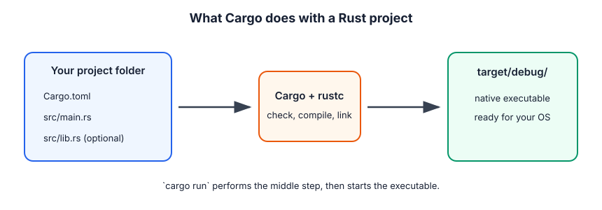

# 1. Getting Started with Rust

Rust is a language for building programs that are fast, reliable, and explicit about who owns data. You do not need to understand ownership yet to start: first learn the small loop of **write, run, read the error, improve**.

## Before you type code

Install Rust with [rustup](https://rustup.rs/). It installs three tools you will use constantly:

- `rustc` compiles Rust source into a native program.
- `cargo` creates projects, builds, runs, tests, and fetches libraries.
- `rustfmt` formats code consistently.

Check that they work:

```bash
rustc --version
cargo --version
```

## Your first program

Create a project instead of a loose `.rs` file:

```bash
cargo new hello_rust
cd hello_rust
cargo run
```

Cargo creates this shape:

```text
hello_rust/
├── Cargo.toml     # project settings and dependencies
└── src/
    └── main.rs    # program entry point
```



`src/main.rs` starts as:

```rust
fn main() {
    println!("Hello, world!");
}
```

`main` is where an executable starts. `println!` prints a line. The `!` means this is a **macro**, a special bit of Rust syntax that generates code; for now, think of it as a very capable function call.

### TypeScript bridge

This is close to:

```ts
function main(): void {
  console.log("Hello, world!");
}
```

The important difference is what happens when you run it. TypeScript usually becomes JavaScript and needs a JavaScript runtime. Rust becomes a machine-code executable that the operating system can run directly.

## What Cargo does for you

Run these from the folder containing `Cargo.toml`:

| Command | Meaning |
| --- | --- |
| `cargo check` | Type-check quickly without producing the final executable. Use this while learning. |
| `cargo run` | Build, then run the program. |
| `cargo build` | Build only. The debug executable goes in `target/debug/`. |
| `cargo build --release` | Build an optimized program in `target/release/`. It takes longer. |
| `cargo fmt` | Format your Rust files. |
| `cargo clippy` | Ask Rust for extra, beginner-friendly suggestions. |
| `cargo test` | Run tests. |

## From source code to a running program

```text
main.rs → rustc checks types and ownership → machine code → executable → operating system runs it
```

Your source file is text on disk. The compiler reads it, rejects unsafe or inconsistent code, and produces CPU instructions. When the executable calls `println!`, it eventually asks the operating system to write bytes to your terminal.

This is why Rust errors can feel strict: the compiler is trying to prove important facts before your program runs.

## Read compiler errors from the top

Try this deliberate mistake:

```rust
fn main() {
    println!("My name is {name}");
}
```

Rust tells you that `name` does not exist. Add it before using it:

```rust
fn main() {
    let name = "Ada";
    println!("My name is {name}");
}
```

Treat an error as a precise question, not a punishment:

1. Read the first error message.
2. Look at the line and the highlighted code.
3. Make the smallest change that answers it.
4. Run `cargo check` again.

## Common first-day mistakes

- Running Cargo from the wrong folder. Move to the directory that contains `Cargo.toml`.
- Forgetting a semicolon after a statement such as `let age = 20;`. Later chapters explain the useful cases where Rust deliberately omits one.
- Editing a file but running an old binary directly. Prefer `cargo run`; it rebuilds when needed.
- Expecting every program to be an executable. A project can also be a library, which starts in `src/lib.rs`.

## Try it now

Change the greeting so it prints your name and a number. Run `cargo fmt`, then `cargo check`, then `cargo run`. The goal is not to memorize commands; it is to make this loop feel ordinary.

Next: [the guessing-game project](./2_programming_a_guessing_game.md).
