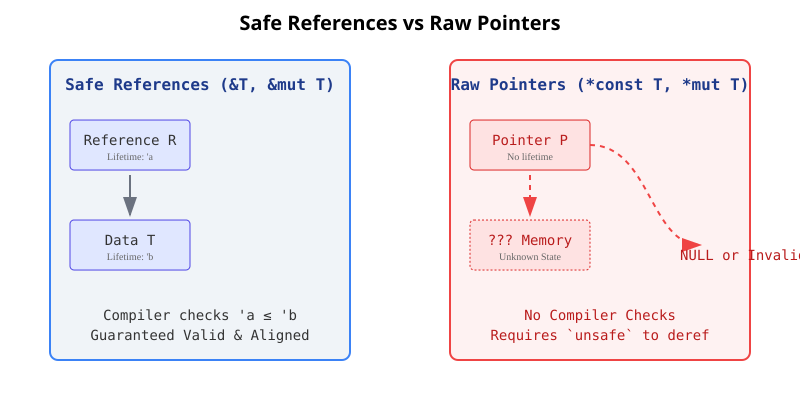

# Chapter 20: Advanced Features

Welcome to the deep end! For developers coming from high-level languages like TypeScript, Rust's memory safety rules often feel like the whole point of the language. However, Rust also provides mechanisms for building low-level abstractions, metaprogramming, and precise control over types and functions.

Here, we will explore Rust's advanced features: `unsafe` Rust, advanced traits, advanced types, advanced functions and closures, and macros.

## 1. Unsafe Rust: Peeking Behind the Safety Guarantees

### Why `unsafe` exists
In TypeScript, you don't worry about raw memory. In Rust, you usually don't either—until you need to write an operating system, a device driver, a garbage collector, or interface with C code. Computer hardware is inherently unsafe. Memory is just a giant array of bytes. If Rust didn't have a way to opt out of the borrow checker's strict rules, it couldn't be used for these tasks. 

### What `unsafe` does and does NOT do
`unsafe` **does not** turn off the borrow checker or disable type checking. It simply gives you 5 specific "superpowers":
1. Dereference a raw pointer.
2. Call an unsafe function or method.
3. Access or modify a mutable static variable.
4. Implement an unsafe trait.
5. Access fields of a `union`.

Everything else—borrow checking on references, type checking, bounds checking on slices—is still active inside an `unsafe` block.

### Raw Pointers (`*const T` and `*mut T`)
Raw pointers are like C pointers. Unlike safe Rust references (`&T` and `&mut T`), raw pointers:
- Are allowed to ignore the borrowing rules by having both immutable and mutable pointers or multiple mutable pointers to the same location.
- Aren't guaranteed to point to valid memory (they can point to freed memory).
- Are allowed to be null.
- Don't implement any automatic cleanup (`Drop`).

**Crucially: Creating a raw pointer is safe. *Dereferencing* it is unsafe.**

```rust
let mut num = 5;

// SAFE: We are just creating pointers. No memory is being accessed yet.
let r1 = &num as *const i32; // immutable raw pointer
let r2 = &mut num as *mut i32; // mutable raw pointer

// UNSAFE: We are reading/writing memory via the raw pointer.
unsafe {
    println!("r1 is: {}", *r1);
    *r2 = 10;
}
```



### Creating Safe Abstractions over Unsafe Code
You should wrap unsafe code in safe APIs. Consider `split_at_mut`, which splits a mutable slice into two at a given index.

```rust
// The borrow checker rejects this:
// fn split_at_mut(values: &mut [i32], mid: usize) -> (&mut [i32], &mut [i32]) {
//     let len = values.len();
//     assert!(mid <= len);
//     // ERROR: cannot borrow `*values` as mutable more than once at a time
//     (&mut values[..mid], &mut values[mid..]) 
// }
```
The compiler isn't smart enough to know we are borrowing *different, non-overlapping* parts of the slice. We can use `unsafe` to bypass this check safely:

```rust
use std::slice;

fn split_at_mut(values: &mut [i32], mid: usize) -> (&mut [i32], &mut [i32]) {
    let len = values.len();
    let ptr = values.as_mut_ptr(); // Gets a raw pointer to the start of the slice

    assert!(mid <= len);

    unsafe {
        (
            slice::from_raw_parts_mut(ptr, mid),
            slice::from_raw_parts_mut(ptr.add(mid), len - mid),
        )
    }
}
```

### Foreign Function Interface (FFI)
Sometimes your Rust code needs to talk to C, or C needs to talk to Rust.
- **Calling C from Rust**: Requires `extern "C"` blocks and is always `unsafe`.
- **Calling Rust from C**: You use `extern "C"` on the Rust function and add `#[no_mangle]` so the Rust compiler doesn't rename the function in the final binary.

### Mutable Static Global Variables
Rust has global variables called `static`. Unlike `const`, `static` variables have a fixed memory address. Mutating a `static` variable is unsafe because multiple threads could read/write simultaneously, causing data races.

```rust
static mut COUNTER: u32 = 0;

fn add_to_count(inc: u32) {
    unsafe {
        COUNTER += inc;
    }
}
```

### Unsafe Traits
A trait is unsafe if at least one of its methods has some invariant that the compiler can't verify. For example, `Send` and `Sync` are unsafe traits (implemented automatically by the compiler). You can manually implement them using `unsafe impl`.

## 2. Advanced Traits

### Associated Types vs Generics
In TypeScript, you use generics almost exclusively (`Iterator<T>`). Rust provides both Generics and Associated Types.

```rust
pub trait Iterator {
    type Item; // Associated type
    fn next(&mut self) -> Option<Self::Item>;
}
```
**Why Associated Types?**
With generics (`trait Iterator<T>`), you could implement `Iterator<String>` and `Iterator<i32>` for the *same type*. When calling `next()`, you'd have to annotate the type to tell Rust which one you want.
With associated types (`type Item;`), a type can only implement `Iterator` *once*. There is only one `Item` type for that implementation.

### Default Generic Type Parameters and Operator Overloading
You can customize the behavior of operators (like `+`) by implementing traits like `std::ops::Add`.

```rust
trait Add<Rhs=Self> {
    type Output;
    fn add(self, rhs: Rhs) -> Self::Output;
}
```
Notice `<Rhs=Self>`. This is a default generic type parameter. If you don't specify the generic type when implementing `Add`, it defaults to `Self` (the type implementing the trait).

### Fully Qualified Syntax for Disambiguation
If a type implements two traits that have a method with the same name, or has its own method with that name, how do you call the trait method?

```rust
trait Animal { fn name() -> String; }
struct Dog;
impl Dog { fn name() -> String { "Spot".to_string() } }
impl Animal for Dog { fn name() -> String { "Dog".to_string() } }

// Calling Animal's name method:
// Fully Qualified Syntax: <Type as Trait>::function(...)
let name = <Dog as Animal>::name(); 
```

### Supertraits
You can require that for a type to implement Trait A, it must also implement Trait B. Trait B is a supertrait of Trait A.

```rust
use std::fmt;
trait OutlinePrint: fmt::Display {
    // Can safely use to_string() because Display is a supertrait
    fn outline_print(&self) { println!("{}", self.to_string()); } 
}
```

### The Newtype Pattern
Rust's orphan rule states you can only implement a trait on a type if either the trait or the type is local to your crate. To get around this, you wrap the external type in a local tuple struct (the Newtype pattern).

```rust
struct Wrapper(Vec<String>); // Wrapper is local to our crate!

impl std::fmt::Display for Wrapper {
    fn fmt(&self, f: &mut std::fmt::Formatter) -> std::fmt::Result {
        write!(f, "[{}]", self.0.join(", "))
    }
}
```

## 3. Advanced Types

### Type Synonyms / Type Aliases
Like TypeScript's `type`, Rust allows you to create aliases to save typing, especially for long, complex types.

```rust
type Kilometers = i32;
type Thunk = Box<dyn Fn() + Send + 'static>;
```

### The Never Type (`!`)
In TypeScript, a function that throws an error or loops infinitely has a return type of `never`. Rust has the exact same concept, represented by the `!` type (the "never type" or "empty type").

Functions like `panic!()`, `process::exit()`, or an infinite `loop` return `!`.
Because a value of type `!` can never exist, `!` can be coerced into *any other type*. This is why this code works:

```rust
let guess = match guess.trim().parse() {
    Ok(num) => num,     // returns u32
    Err(_) => continue, // returns !, which coerces to u32
};
```

### Dynamically Sized Types (DSTs) and the `Sized` Trait
Most types in Rust have a size known at compile time (`i32`, `f64`, `String` pointers). However, some types have a size known only at runtime (Dynamically Sized Types).
Examples include `str` (the string slice, not `&str`) and `[i32]` (an array slice, not `&[i32]`). 

You can't have a local variable of type `str` because Rust doesn't know how much memory to allocate. You must put it behind a pointer (like `&str` or `Box<str>`), which *does* have a known size (it stores the memory address and the length).

Rust automatically adds an implicit `T: Sized` bound to every generic function. To opt out, you use the `?Sized` bound ("T may or may not be sized"):

```rust
fn generic<T: ?Sized>(t: &T) { } // t must be a reference because T might not be sized
```

## 4. Advanced Functions and Closures

### Function Pointers (`fn`)
You can pass regular functions to other functions, not just closures. A function pointer type is written `fn` (lowercase f).
Unlike closures (which are traits: `Fn`, `FnMut`, `FnOnce`), a function pointer is a concrete type—a 4-to-8 byte pointer directly to the machine code address.

```rust
fn add_one(x: i32) -> i32 { x + 1 }

// f is a function pointer
fn do_twice(f: fn(i32) -> i32, arg: i32) -> i32 {
    f(arg) + f(arg)
}
```
Function pointers implement all three closure traits. Therefore, you can pass a function pointer anywhere a closure is expected. When interfacing with C code, you must use function pointers because C doesn't have closures.

### Returning Closures
In TypeScript, returning a closure is trivial. In Rust, you can't return a closure directly because closures are dynamically sized—each closure has a unique, compiler-generated, unnameable type based on what it captures. 
Since Rust doesn't know the size at compile time, you must put the closure behind a pointer, like a `Box`.

```rust
fn returns_closure() -> Box<dyn Fn(i32) -> i32> {
    Box::new(|x| x + 1)
}
```

## 5. Macros: Metaprogramming

### Macros vs Functions
Fundamentally, macros write other code for you at **compile time**.
- Functions must have a fixed number of parameters with specific types.
- Macros can take a variable number of arguments (e.g., `println!("hello")` or `println!("hello {}", name)`).
- Macros are expanded into Rust code *before* the compiler translates the code into machine instructions.

### Declarative Macros with `macro_rules!`
These match against patterns in Rust syntax (the Abstract Syntax Tree) and replace them with code. Think of it like a `match` expression for source code.

```rust
#[macro_export]
macro_rules! vec {
    ( $( $x:expr ),* ) => {
        {
            let mut temp_vec = Vec::new();
            $(
                temp_vec.push($x);
            )*
            temp_vec
        }
    };
}
```
- `$x:expr` captures a Rust expression and binds it to `$x`.
- `$( ... ),*` says "match zero or more expressions separated by commas".
- In the body, `$( temp_vec.push($x); )*` generates a `push` statement for every expression matched.

### Procedural Macros
Procedural macros are more like functions. They take Rust source code (TokenStreams), run arbitrary Rust code to manipulate those tokens, and return new TokenStreams. They are highly powerful and operate more like compiler plugins.

There are three kinds:
1. **Custom `#[derive]` macros**: Let you automatically implement traits for a struct/enum (`#[derive(Serialize)]`).
2. **Attribute-like macros**: Let you create custom attributes to apply to functions/structs (`#[route(GET, "/")]`).
3. **Function-like macros**: Invoked like a macro but look like a function call (`sql!(SELECT * FROM users)`).

---

## References
file:///Users/codingsimba/.rustup/toolchains/stable-x86_64-apple-darwin/share/doc/rust/html/book/ch20-00-advanced-features.html
file:///Users/codingsimba/.rustup/toolchains/stable-x86_64-apple-darwin/share/doc/rust/html/book/ch20-01-unsafe-rust.html
file:///Users/codingsimba/.rustup/toolchains/stable-x86_64-apple-darwin/share/doc/rust/html/book/ch20-02-advanced-traits.html
file:///Users/codingsimba/.rustup/toolchains/stable-x86_64-apple-darwin/share/doc/rust/html/book/ch20-03-advanced-types.html
file:///Users/codingsimba/.rustup/toolchains/stable-x86_64-apple-darwin/share/doc/rust/html/book/ch20-04-advanced-functions-and-closures.html
file:///Users/codingsimba/.rustup/toolchains/stable-x86_64-apple-darwin/share/doc/rust/html/book/ch20-05-macros.html
