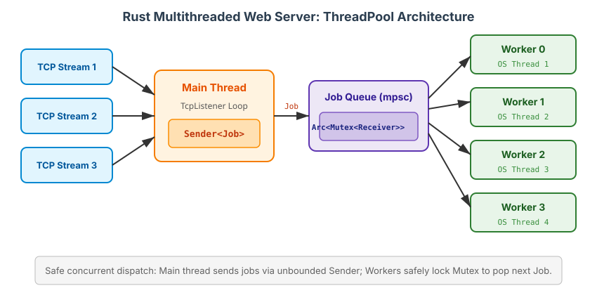

# 21. Multithreaded Web Server

In this capstone project, we apply Rust's concurrency, memory management, and typing models to build a functional multithreaded web server from scratch.

## 1. The Goal
Our goal is to build an HTTP server listening on TCP port `7878`, using only the Rust standard library (`std::net`). 

### TS Analogy
In Node.js/TypeScript, you'd typically use `http.createServer()` or Express. Under the hood, Node.js binds to a TCP socket and parses HTTP text over the stream, using an event loop (libuv) to handle concurrency. In Rust, we will interact directly with the raw TCP streams and manually implement a Thread Pool to mimic concurrent handling.

## 2. Single-Threaded Server
We start by binding to a port and listening for raw bytes.

```rust
use std::net::TcpListener;

fn main() {
    let listener = TcpListener::bind("127.0.0.1:7878").unwrap();

    // Iterate over incoming connections
    for stream in listener.incoming() {
        let stream = stream.unwrap();
        // Handle the raw TCP stream here
    }
}
```

An HTTP response is just text sent over this stream in a specific format:
```text
HTTP/1.1 200 OK\r\n\r\nHello Web!
```

## 3. The Bottleneck
If we handle each request synchronously (e.g., reading a file and writing back), a slow request (like a route `/sleep` that sleeps for 5 seconds) will block the main thread.
Because TCP connections queue up sequentially in a single-threaded server, no other user can get a response until the sleeping route finishes.

## 4. Building a `ThreadPool`

To process requests concurrently, why not spawn a new OS thread for every incoming connection?
```rust
// BAD IDEA IN PRODUCTION
std::thread::spawn(|| { handle_connection(stream); });
```
**Resource Exhaustion:** If an attacker sends 100,000 requests (Denial of Service), your OS tries to create 100,000 threads. Each thread requires memory (stack space) and CPU context-switching overhead. Your server will crash.

### The Solution: A Thread Pool
Instead, we spawn a *fixed* number of threads (Worker pool) at startup (e.g., 4 threads). Incoming requests are bundled as `Job`s and sent into a queue. Idle workers pull from the queue.



### Passing Jobs to Workers
We need a way for the main thread to send closures (jobs) to the workers. We use a **Channel** (`mpsc`).
To share the receiving end of the channel among multiple workers safely, we use:
`Arc<Mutex<mpsc::Receiver<Job>>>`
- `Arc`: Atomic Reference Counted (so multiple workers can own a reference to the receiver).
- `Mutex`: Mutual Exclusion (only one worker can pop a job from the channel at a time).

### Defining a `Job`
A `Job` is just a closure that we want to execute later.
```rust
type Job = Box<dyn FnOnce() + Send + 'static>;
```
- `Box<dyn ...>`: Trait object. Since closures have different sizes, we put them on the heap (`Box`) and use dynamic dispatch (`dyn`).
- `FnOnce()`: The closure takes no arguments and is executed exactly once.
- `Send`: Can be transferred across thread boundaries safely.
- `'static`: The closure might live arbitrarily long, so it shouldn't borrow local stack variables that might get dropped.

## 5. Graceful Shutdown

When we shut down the server, we want workers to finish their current jobs before exiting.
1. **Drop the Sender:** We drop the `mpsc::Sender` in the main thread. This closes the channel.
2. **Workers Exit:** The workers, constantly calling `receiver.lock().unwrap().recv()`, will receive an error because the channel is closed. We configure them to `break` their infinite loop upon this error.
3. **Join Threads:** In the `Drop` implementation for our `ThreadPool`, we iterate through all our workers and call `worker.thread.join().unwrap()` to wait for them to finish naturally.

---

## References
file:///Users/codingsimba/.rustup/toolchains/stable-x86_64-apple-darwin/share/doc/rust/html/book/ch21-00-final-project-a-web-server.html
file:///Users/codingsimba/.rustup/toolchains/stable-x86_64-apple-darwin/share/doc/rust/html/book/ch21-01-single-threaded.html
file:///Users/codingsimba/.rustup/toolchains/stable-x86_64-apple-darwin/share/doc/rust/html/book/ch21-02-multithreaded.html
file:///Users/codingsimba/.rustup/toolchains/stable-x86_64-apple-darwin/share/doc/rust/html/book/ch21-03-graceful-shutdown-and-cleanup.html

