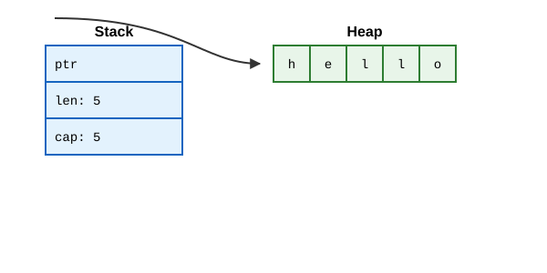
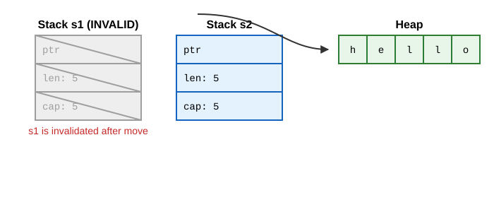
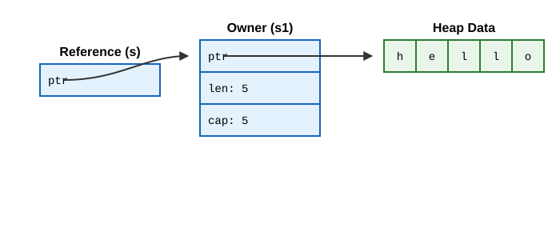
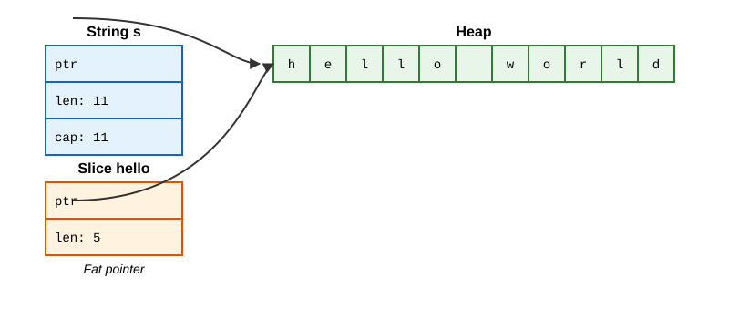

# Understanding ownership

Rust’s defining feature is **ownership**. It enables Rust to make memory safety guarantees without needing a garbage collector (like TypeScript has).

## 1. What Is Ownership?

In TypeScript, memory management is invisible. When you create an object, the JS engine allocates it on the heap. When nothing references it anymore, the garbage collector (GC) eventually frees it.
Rust handles memory differently. Memory is managed through a system of ownership with a set of rules that the compiler checks. If any of the rules are violated, the program won't compile.

### Ownership Rules
These are the three golden rules of ownership in Rust:
1. **Each value in Rust has an owner.**
2. **There can only be one owner at a time.**
3. **When the owner goes out of scope, the value will be dropped.**

### Variable Scope
Scope works similarly to TypeScript's `let` and `const` block scoping.

```rust
{                      // s is not valid here, it’s not yet declared
    let s = "hello";   // s is valid from this point forward
    // do stuff with s
}                      // this scope is now over, and s is no longer valid
```

### The `String` Type
To illustrate ownership, we need a complex data type allocated on the heap. String literals (`&str`) are hardcoded into the executable, but `String` is a growable, mutable, heap-allocated string.

```rust
let s = String::from("hello"); // allocated on the heap
```

### Memory and Allocation
When a variable goes out of scope, Rust automatically calls a special function called `drop` and returns the memory to the allocator.

A `String` is made up of three parts, stored on the **stack**:
1. A pointer to the memory that holds the contents of the string.
2. A length (how much memory in bytes the contents currently use).
3. A capacity (total amount of memory in bytes that the `String` has received from the allocator).

The actual string data is stored on the **heap**.




### Move Semantics
In TypeScript, if you assign an object to another variable, both point to the same object:
```typescript
let s1 = { text: "hello" };
let s2 = s1; // Both s1 and s2 point to the same object in memory
```

In Rust, this behaves very differently:
```rust
let s1 = String::from("hello");
let s2 = s1;

// println!("{}, world!", s1); // ERROR! s1 has been invalidated
```
To ensure memory safety (rule 2: one owner at a time), after `let s2 = s1;`, Rust considers `s1` as no longer valid. This prevents "double free" errors where both variables might try to drop the same memory when going out of scope. This is called a **move**. `s1` was moved into `s2`.



*(Note: the stack data for `s1` is technically still there but marked invalid by the compiler. Only `s2` has ownership of the heap data).*

### Clone
If we *do* want to deeply copy the heap data (like cloning an object in TS), we use the `clone` method:
```rust
let s1 = String::from("hello");
let s2 = s1.clone();
```
Now both variables are valid, pointing to different memory blocks on the heap.

### Copy Trait
Types with a known size at compile time (like integers, booleans, floating point numbers) are stored entirely on the stack. For these types, a simple bitwise copy is fast, so they are not moved. Instead, they are copied.
```rust
let x = 5;
let y = x; // y is a copy of x. x is still valid!
```
Rust has a special annotation called the `Copy` trait. If a type implements `Copy`, variables that use it do not move, but rather are trivially copied. Types that require heap allocation (like `String`) cannot implement `Copy`.

### Ownership and Functions
Passing a variable to a function will move or copy, just as assignment does.
```rust
fn main() {
    let s = String::from("hello");
    takes_ownership(s);
    // s is no longer valid here!

    let x = 5;
    makes_copy(x);
    // x is still valid here!
}

fn takes_ownership(some_string: String) { // some_string comes into scope
    println!("{}", some_string);
} // some_string goes out of scope and `drop` is called. Memory is freed.

fn makes_copy(some_integer: i32) { // some_integer comes into scope
    println!("{}", some_integer);
} // some_integer goes out of scope.
```

### Return Values and Scope
Returning values can also transfer ownership. Just as passing a value to a function moves it into the parameter, returning a value from a function moves it out to the caller.

```rust
fn main() {
    let s1 = gives_ownership();         // gives_ownership moves its return value into s1

    let s2 = String::from("hello");     // s2 comes into scope

    let s3 = takes_and_gives_back(s2);  // s2 is moved into takes_and_gives_back,
                                        // which moves its return value into s3
} // s3 goes out of scope and is dropped. s2 was moved, so nothing happens. s1 is dropped.

fn gives_ownership() -> String {
    let some_string = String::from("yours");
    some_string                         // some_string is returned and moves out to the caller
}

fn takes_and_gives_back(a_string: String) -> String {
    a_string                            // a_string is returned and moves out to the caller
}
```

While returning tuples (e.g. `(String, usize)`) allows returning both the original value and computed results, this pattern is clumsy. That is why Rust provides **references and borrowing**.

---

## 2. References and Borrowing

Moving ownership everywhere is tedious. What if you want a function to use a value without taking ownership? In Rust, we use **references** (`&T`), which allow you to borrow a value.

### References (`&T`)
A reference is like a pointer that is guaranteed to point to a valid value of a particular type.

```rust
fn main() {
    let s1 = String::from("hello");
    let len = calculate_length(&s1); // We pass a reference, not ownership
    println!("The length of '{}' is {}.", s1, len); // s1 is still valid!
}

fn calculate_length(s: &String) -> usize { // s is a reference to a String
    s.len()
} // s goes out of scope. But because it does not have ownership, nothing is dropped.
```




### Mutable References (`&mut T`)
References are immutable by default, just like variables. To modify a borrowed value, we need a mutable reference.

```rust
fn main() {
    let mut s = String::from("hello");
    change(&mut s);
}

fn change(some_string: &mut String) {
    some_string.push_str(", world");
}
```

**The Big Rule of Mutable References:** You can have only *one* mutable reference to a particular piece of data in a particular scope.
```rust
let mut s = String::from("hello");
let r1 = &mut s;
let r2 = &mut s; // ERROR: cannot borrow `s` as mutable more than once at a time
```
You also cannot combine mutable and immutable references:
```rust
let mut s = String::from("hello");
let r1 = &s; // no problem
let r2 = &s; // no problem
let r3 = &mut s; // ERROR: cannot borrow `s` as mutable because it is also borrowed as immutable
```
**Why?** This prevents **data races** at compile time! A data race happens when multiple pointers access the same data concurrently, at least one is writing, and there's no synchronization.

### Dangling References
In languages with manual memory management (C/C++), it's easy to create a dangling pointer—a pointer that references memory that has been freed.
Rust's compiler guarantees references will never be dangling.

```rust
fn main() {
    let reference_to_nothing = dangle();
}

fn dangle() -> &String { // returns a reference to a String
    let s = String::from("hello"); // s is a new String
    &s // we return a reference to the String, s
} // Here, s goes out of scope, and is dropped. Its memory goes away.
  // Danger! Rust compiler catches this and refuses to compile.
```

### Rules of References
1. At any given time, you can have *either* one mutable reference *or* any number of immutable references.
2. References must always be valid (no dangling references).

### Non-Lexical Lifetimes (NLL)
A reference’s scope starts from where it is introduced and continues through the last time that reference is used. This is more flexible than strict block scope.
```rust
let mut s = String::from("hello");
let r1 = &s; // r1 starts
let r2 = &s; // r2 starts
println!("{} and {}", r1, r2); // r1 and r2 are used for the last time

let r3 = &mut s; // This works! r1 and r2's lifetimes have ended.
println!("{}", r3);
```

---

## 3. The Slice Type

Slices let you reference a contiguous sequence of elements in a collection rather than the whole collection. Slices do not take ownership.

### String Slices (`&str`)
A string slice is a reference to part of a `String`.

```rust
let s = String::from("hello world");
let hello = &s[0..5];
let world = &s[6..11];
```

With Rust’s `..` range syntax:
- `&s[0..2]` is identical to `&s[..2]` (starting at index 0 can drop the first number).
- `&s[3..len]` is identical to `&s[3..]` (trailing index up to length can drop the second number).
- `&s[0..len]` is identical to `&s[..]` (slices the entire string).



Notice that a slice is a **fat pointer**: it contains both a pointer to the start of the slice in memory and the length of the slice (2 `usize`s on the stack = 16 bytes on 64-bit).

### String Literals are Slices
When you write:
```rust
let s: &str = "Hello, world!";
```
The string data is hardcoded into the read-only data segment of the binary. `s` is just a slice (`&'static str`) pointing to that specific spot in the binary. This is why string literals are immutable.

### String Slices as Parameters (Deref Coercion)
Knowing that you can take slices of literals and `String` values leads to a major Rust idiom.

If you have a function that reads string data, write it to accept `&str` rather than `&String`:
```rust
// Less flexible: only accepts &String
fn first_word_inflexible(s: &String) -> &str { ... }

// Idiomatic Rust: accepts &String, &str literals, and slices!
fn first_word(s: &str) -> &str {
    let bytes = s.as_bytes();
    for (i, &item) in bytes.iter().enumerate() {
        if item == b' ' {
            return &s[0..i];
        }
    }
    &s[..]
}
```
**Why?**
Through a feature called **Deref Coercion**, Rust automatically converts a reference to a `String` (`&String`) into a string slice (`&str`).
- If you have a `String`, you can pass `&my_string` or `&my_string[..]`.
- If you have a `&str` literal, you can pass it directly: `first_word("hello world")`.
Defining parameters as `&str` makes your API much more general without losing any functionality.

### Other Slices
Slices work for other collections too, like arrays:
```rust
let a = [1, 2, 3, 4, 5];
let slice: &[i32] = &a[1..3]; // contains [2, 3]
```
The internal representation is exactly the same: a fat pointer (pointer to first element + length in number of elements).

## References
file:///Users/codingsimba/.rustup/toolchains/stable-x86_64-apple-darwin/share/doc/rust/html/book/ch04-00-understanding-ownership.html
file:///Users/codingsimba/.rustup/toolchains/stable-x86_64-apple-darwin/share/doc/rust/html/book/ch04-01-what-is-ownership.html
file:///Users/codingsimba/.rustup/toolchains/stable-x86_64-apple-darwin/share/doc/rust/html/book/ch04-02-references-and-borrowing.html
file:///Users/codingsimba/.rustup/toolchains/stable-x86_64-apple-darwin/share/doc/rust/html/book/ch04-03-slices.html