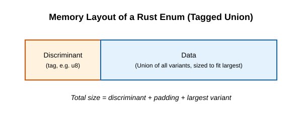

# Enum and pattern matching

Enums in Rust are much more powerful than enums in TypeScript. In TypeScript, an enum is simply a set of named constants. In Rust, an enum is a way of defining a type by enumerating its possible *variants*, and those variants can contain data. This makes Rust enums equivalent to TypeScript's **discriminated unions** (also called algebraic data types).

## 1. Defining an Enum

In TypeScript, to get an enum that holds data, you would write a discriminated union:

```typescript
// TypeScript Discriminated Union
type Shape = 
  | { kind: 'circle'; radius: number }
  | { kind: 'square'; side: number };
```

In Rust, this concept is built natively into the enum keyword:

```rust
// Rust Enum
enum Shape {
    Circle { radius: f64 }, // struct-like variant
    Square { side: f64 },   // struct-like variant
}
```

### Different Variant Types

Rust enums support three kinds of variants:
1. **Unit-like variants:** No data (like TypeScript enums).
2. **Tuple variants:** Holds an anonymous tuple of types.
3. **Struct variants:** Holds named fields.

```rust
enum Message {
    Quit,                       // Unit variant
    Move(i32, i32),             // Tuple variant
    Write(String),              // Tuple variant with one element
    ChangeColor { r: u8, g: u8, b: u8 }, // Struct variant
}
```

### Methods on Enums (`impl` blocks)

Just like structs, you can define methods on enums using `impl` blocks.

```rust
impl Message {
    fn call(&self) {
        // Method body here
    }
}

let m = Message::Write(String::from("hello"));
m.call();
```

### Internal Memory Layout and Tagged Unions

Behind the scenes, a Rust enum is implemented as a **tagged union**. It stores two pieces of information:
1. A **discriminant** (or tag) that identifies which variant is currently stored.
2. The **payload** (data) of that variant.

The size of the enum in memory is equal to the size of its *largest* variant plus the size of the discriminant (usually 1 byte for enums with up to 256 variants), plus any padding required for alignment.




For example, if `Move(i32, i32)` is the largest variant (8 bytes), and the tag takes 1 byte (padded to 4 for alignment), the total size of `Message` might be 12 bytes.

## 2. The `Option<T>` Enum

Rust does **not** have the concept of `null` or `undefined`. Instead, Rust uses an enum called `Option<T>` to encode the concept of a value being present or absent.

```rust
enum Option<T> {
    None,
    Some(T),
}
```

In TypeScript, you might write `let name: string | null;`. In Rust, you write `let name: Option<String>;`. This is superior because it forces you to explicitly handle the `None` case—you cannot accidentally use an `Option<T>` as if it were a `T`.

### Common `Option` Methods (High-Level & Internals)

Because `Option<T>` is so central, the standard library equips it with dozens of ergonomic methods. Under the hood, almost all of them compile down to simple pattern matching or pointer manipulations:

#### 1. Extracting Values
- **`unwrap(self) -> T`**:
  - *High-Level:* Returns the inner value `T` if `Some`. Panics if `None`.
  - *Behind the Scenes:* Takes `self` by value (consuming the Option). Performs a discriminant check; if variant is `Some`, moves the stack payload `T` out. If `None`, calls `panic!()`.
- **`expect(self, msg: &str) -> T`**:
  - *High-Level:* Same as `unwrap()`, but with a custom panic message for debugging.
  - *Behind the Scenes:* Exactly identical to `unwrap()`, but passes `msg` to the panic runtime handler.
- **`unwrap_or(self, default: T) -> T`**:
  - *High-Level:* Returns inner `T` if `Some`, otherwise returns the fallback value `default`.
  - *Behind the Scenes:* Note: `default` is eagerly evaluated! Even if `opt` is `Some`, `default` is constructed on the stack before being passed to the function.
- **`unwrap_or_else<F>(self, f: F) -> T where F: FnOnce() -> T`**:
  - *High-Level:* Returns inner `T` if `Some`, otherwise invokes closure `f` to compute fallback lazily.
  - *Behind the Scenes:* Zero heap or stack construction for fallback unless the discriminant is `None`.
- **`unwrap_or_default(self) -> T where T: Default`**:
  - *High-Level:* Returns inner `T` if `Some`, or `T::default()` if `None`.

#### 2. Transforming Options
- **`map<U, F>(self, f: F) -> Option<U> where F: FnOnce(T) -> U`**:
  - *High-Level:* Transforms `Option<T>` to `Option<U>` by applying `f` to the contained value.
  - *Behind the Scenes:* Consumes `self`. If `Some(v)`, runs `f(v)` and wraps in `Some`. If `None`, returns `None` without invoking `f`. In assembly, this inlines to a single conditional jump.
- **`and_then<U, F>(self, f: F) -> Option<U> where F: FnOnce(T) -> Option<U>`**:
  - *High-Level:* Monadic bind / `flatMap`. Chains operations where the closure itself returns an `Option`.
  - *Behind the Scenes:* Prevents nested `Option<Option<U>>`. If `self` is `Some(v)`, returns `f(v)`. If `None`, directly yields `None`.
- **`filter<P>(self, predicate: P) -> Option<T> where P: FnOnce(&T) -> bool`**:
  - *High-Level:* Keeps `Some` if the predicate returns `true`; turns it into `None` if `false`.
  - *Behind the Scenes:* Borrows `&v` to evaluate `predicate`. If false, calls `drop(v)` and returns `None`.

#### 3. Borrowing & Ownership Mechanics (Critical for Borrow Checker)
- **`as_ref(&self) -> Option<&T>`**:
  - *High-Level:* Borrows the value inside the option without consuming the original Option.
  - *Behind the Scenes:* Transforms `&Option<T>` into an `Option<&T>`. In memory, it creates a new Option whose payload is a pointer (`&T`) to the data inside the existing option. This is essential when you want to pattern match on an Option without moving its contents.
- **`as_mut(&mut self) -> Option<&mut T>`**:
  - *High-Level:* Borrows a mutable reference to the inner value without consuming the Option.
  - *Behind the Scenes:* Produces an `Option<&mut T>` pointing directly into the mutable memory of `self`.
- **`take(&mut self) -> Option<T>`**:
  - *High-Level:* Takes the value out of the `Option`, leaving `None` in its place.
  - *Behind the Scenes:* Calls `std::mem::replace(self, None)`. Extremely important in Rust: it allows you to take ownership of `T` out of a mutable reference `&mut Option<T>` without violating memory safety!
- **`replace(&mut self, value: T) -> Option<T>`**:
  - *High-Level:* Replaces the current value with `Some(value)` and returns the old value.
  - *Behind the Scenes:* Uses `std::mem::replace(self, Some(value))`.
- **`cloned(&self) -> Option<T> where T: Clone` / `copied(&self) -> Option<T> where T: Copy`**:
  - *High-Level:* Turns `Option<&T>` back into an owned `Option<T>` by cloning or copying.

#### 4. Combinators & Interop
- **`zip<U>(self, other: Option<U>) -> Option<(T, U)>`**:
  - *High-Level:* Combines two options into one containing a tuple `(T, U)` if both are `Some`.
- **`flatten(self) -> Option<U> where T = Option<U>`**:
  - *High-Level:* Flattens `Option<Option<U>>` into `Option<U>`.
- **`ok_or<E>(self, err: E) -> Result<T, E>`**:
  - *High-Level:* Converts `Option<T>` to `Result<T, E>` (`Some(v)` -> `Ok(v)`, `None` -> `Err(err)`).
- **`transpose(self) -> Result<Option<T>, E>` (for `Option<Result<T, E>>`)**:
  - *High-Level:* Swaps an `Option` of a `Result` into a `Result` of an `Option`.

### Niche Optimization

Sometimes, an enum doesn't need space for a discriminant! For example, `Option<&T>`. 
A reference `&T` can never be a null pointer in safe Rust. Therefore, the Rust compiler performs **null pointer optimization** (niche optimization). It represents `None` as the literal null pointer `0x0`, and `Some(ptr)` as the valid pointer.

**Internally:** The size of `Option<&T>` is identical to `&T` (typically 8 bytes on 64-bit systems), with no extra tag byte!

## 3. The `match` Control Flow

To extract data from an enum, you use pattern matching. The `match` expression is like an exhaustive, type-safe TypeScript `switch` statement that can unpack data.

### Patterns that Bind to Values
Match arms can bind to parts of the values that match the pattern. This is how you extract data out of enum variants.

```rust
#[derive(Debug)]
enum UsState {
    Alabama,
    Alaska,
    // ...
}

enum Coin {
    Penny,
    Nickel,
    Dime,
    Quarter(UsState),
}

fn value_in_cents(coin: Coin) -> u8 {
    match coin {
        Coin::Penny => 1,
        Coin::Nickel => 5,
        Coin::Dime => 10,
        Coin::Quarter(state) => {
            println!("State quarter from {:?}!", state);
            25
        }
    }
}
```

### Matching with `Option<T>`
You can also match on `Option<T>` just like any other enum:

```rust
fn plus_one(x: Option<i32>) -> Option<i32> {
    match x {
        None => None,
        Some(i) => Some(i + 1),
    }
}
```

### Key Properties of `match`:
- **Exhaustive:** You MUST handle all variants. If you forget one, the compiler will refuse to compile.
- **Binding:** You can bind variables to the internal data of the enum variants (like `state` and `i` above).
- **Expression:** `match` returns a value, so you can assign its result to a variable.

### Catch-all Patterns and the `_` Placeholder
When you don't want to list every possible value:

1. **Catch-all with variable binding (`other`):** Matches any remaining value and binds it to a variable so you can use it.
   ```rust
   match dice_roll {
       3 => add_fancy_hat(),
       7 => remove_fancy_hat(),
       other => move_player(other), // 'other' covers all other numbers and uses the value
   }
   ```
2. **Wildcard placeholder (`_`):** Matches any remaining value but **does not bind** it.
   ```rust
   match dice_roll {
       3 => add_fancy_hat(),
       7 => remove_fancy_hat(),
       _ => reroll(), // Any other number calls reroll without needing the value
   }
   ```
3. **Do nothing unit value (`_ => ()`):**
   ```rust
   match dice_roll {
       3 => add_fancy_hat(),
       _ => (), // Nothing happens for any other roll
   }
   ```

### Compilation / Internals

When compiled, `match` statements on enums with discriminants are typically compiled down to **jump tables** or a series of branch comparisons depending on the number of variants. A jump table allows the CPU to immediately jump to the correct machine code based on the discriminant integer (e.g., jump to `Table[Discriminant]`), making it an $O(1)$ dispatch without sequential `if/else` checks.

## 4. `if let` and `let else`

Sometimes `match` is too verbose if you only care about ONE variant.

### `if let`

`if let` is syntactic sugar for a `match` that runs code only if it matches one pattern, ignoring all others.

```rust
// Instead of:
match config_max {
    Some(max) => println!("Max is {}", max),
    _ => (),
}

// Write:
if let Some(max) = config_max {
    println!("Max is {}", max);
}
```

### `let else`

`let else` is the inverse. It allows you to bind variables from a pattern directly into the surrounding scope, but requires a divergent block (`return`, `break`, `panic!`) if the pattern doesn't match.

```rust
fn process_value(opt: Option<i32>) {
    // If opt is None, we return early. If Some, 'val' is now available!
    let Some(val) = opt else {
        return;
    };
    
    println!("Value is {}", val); // val is bound to the rest of the scope
}
```

**When to use which:**
- Use `match` when you need to handle multiple variants or exhaustive checking is crucial.
- Use `if let` when you want to execute a small block of code for exactly one variant.
- Use `let else` to do "early returns" (guard clauses) when you want to unwrap an enum without nesting your code.

## References
file:///Users/codingsimba/.rustup/toolchains/stable-x86_64-apple-darwin/share/doc/rust/html/book/ch06-00-enums.html
file:///Users/codingsimba/.rustup/toolchains/stable-x86_64-apple-darwin/share/doc/rust/html/book/ch06-01-defining-an-enum.html
file:///Users/codingsimba/.rustup/toolchains/stable-x86_64-apple-darwin/share/doc/rust/html/book/ch06-02-match.html
file:///Users/codingsimba/.rustup/toolchains/stable-x86_64-apple-darwin/share/doc/rust/html/book/ch06-03-if-let.html