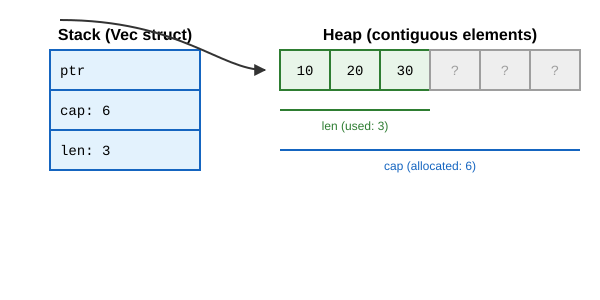
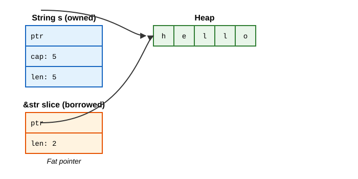

# Common Collections

In TypeScript, you are used to working heavily with `Array`, `String`, `Map`, and `Set` (or plain objects). In Rust, collections serve similar purposes, but they give you much finer control over how and where data is allocated in memory. The three most common collections are `Vec<T>`, `String`, and `HashMap<K, V>`.

All three of these collections allocate data on the **heap** because their size can grow or shrink at runtime, and their lengths are not known at compile time.

---

## 1. Vectors (`Vec<T>`)

A `Vec<T>` (pronounced "vector") is a growable array. In TypeScript, this is equivalent to `Array<T>`. It stores elements of type `T` contiguously in memory. Because the elements are next to each other, accessing them by index is extremely fast ($O(1)$).

### Memory Layout

A `Vec<T>` consists of three pieces of information stored on the **stack**, which point to the actual elements stored on the **heap**:
- **Pointer (`ptr`)**: Points to the start of the data on the heap.
- **Capacity (`cap`)**: The total amount of memory currently allocated on the heap (how many elements it *can* hold before needing to reallocate).
- **Length (`len`)**: The number of elements currently stored in the vector.




### Creating and Growing

You can create a new vector using `Vec::new()` or the `vec![]` macro.

```rust
let mut v1: Vec<i32> = Vec::new();
let mut v2 = vec![1, 2, 3]; // infers Vec<i32>
let v3 = vec![0; 5]; // [0, 0, 0, 0, 0]
```

**How it grows:** When you `push` an element and `len == cap`, the vector has run out of space. It will:
1. Allocate a new, larger chunk of memory on the heap (usually double the current capacity).
2. Copy the existing elements to the new allocation.
3. Free the old memory allocation.
4. Update its `ptr` and `cap` on the stack.

Because doubling capacity happens infrequently as the vector grows, the time complexity of pushing an element is **amortized $O(1)$**.

### Key Methods

#### Basic Operations (Memory Mechanics)
- `push(value)`: Appends an element to the back.
  - *Behind the Scenes:* Checks `if len == cap`. If capacity is exceeded, calls the global allocator's `realloc` to allocate a new buffer (typically double the size), copies existing bytes, frees the old buffer, and updates the stack `ptr` and `cap`. Then writes `value` at address `ptr + (len * size_of::<T>())` and increments `len += 1`. Amortized $O(1)$.
- `pop() -> Option<T>`: Removes and returns the last element.
  - *Behind the Scenes:* If `len == 0`, returns `None`. Otherwise, decrements `len -= 1` and reads the item at `ptr + (len * size_of::<T>())` using `std::ptr::read`. **Note:** It does *not* reallocate or shrink memory—the unused heap slot remains allocated for future pushes.
- `len()`: Returns the number of initialized elements (`usize` on stack).
- `capacity()`: Returns total allocated elements before reallocation is needed.
- `is_empty()`: Checks `len == 0`.

#### Accessing Elements
- `get(index)`: Returns `Option<&T>` (or `Option<&mut T>` for `get_mut()`). Performs a bounds check (`index < len`). Safe to use; returns `None` without panicking if out of bounds.
- `[]` Indexing (e.g. `v[0]`): Translates directly to `*v.index(0)`. Returns `&T`. Emits a runtime bounds check: if `index >= len`, it invokes `panic!` with an index out-of-bounds error.

#### Modification & Memory Shifting
- `insert(index, element)`: Inserts `element` at `index`.
  - *Behind the Scenes:* If `len == cap`, grows buffer first. Then uses `memmove` / `copy` to shift all elements from `index..len` one slot to the right ($O(n)$ memcpy overhead). Writes `element` into slot `index` and increments `len += 1`.
- `remove(index) -> T`: Removes and returns element at `index`.
  - *Behind the Scenes:* Reads element at `index` out via `ptr::read`. Uses `copy` to shift all elements from `index + 1..len` one slot to the left ($O(n)$). Decrements `len -= 1`.
- `swap_remove(index) -> T`: Removes element by swapping it with the *last* element.
  - *Behind the Scenes:* Swaps element at `index` with element at `len - 1`, then pops `len - 1`. $O(1)$ constant time with zero memory shifting! **Drawback:** Does not preserve order.

#### Bulk Operations
- `extend(iterable)`: Appends items from an iterable. If iterator implements `ExactSizeIterator`, pre-allocates exact capacity in one shot.
- `append(&mut other_vec)`: Moves elements from `other_vec` to `self`. Reallocates `self` if needed, memcpy's bytes, and sets `other_vec.len = 0` without deallocating `other_vec`'s buffer.
- `truncate(len)`: Shortens the vector. Drops all elements from `new_len..old_len` in place and sets `len = new_len`. Does not change capacity.
- `clear()`: Drops each element in place from index 0 to `len`, then sets `len = 0`. Stack `cap` and heap allocation remain intact for reuse.
- `drain(range)`: Returns an iterator that removes the specified range and yields ownership of the removed items. On iterator drop, shifts remaining elements forward to fill the gap.

#### Searching & Filtering
- `retain(|&x| condition)`: Keeps only the elements that satisfy the predicate. Modifies the vector in place. Similar to TS `filter`, but mutates.
- `dedup()`: Removes consecutive duplicate elements. Usually called after sorting.
- `sort()`: Sorts the vector in place.
- `sort_by(|a, b| ...)`: Sorts using a custom comparator.
- `binary_search(&value)`: Searches for a value in a sorted vector. Returns `Result<usize, usize>` (index if found, or insertion point if not).
- `contains(&value)`: Returns `true` if the vector contains the value.
- `starts_with(&slice)` / `ends_with(&slice)`: Checks if the vector starts/ends with a given sequence.

#### Splitting & Slicing
- `split_at(index)` / `split_at_mut(index)`: Divides the vector into two slices at an index.
- `split_first()`, `split_last()`: Returns a tuple of the first/last element and a slice of the rest.
- `windows(size)`: Returns an iterator over overlapping subslices of `size`.
- `chunks(size)`: Returns an iterator over non-overlapping subslices of `size`.
- `as_slice()` / `as_mut_slice()`: Extracts a slice `&[T]` containing the entire vector.

#### Memory Management
- `with_capacity(capacity)`: Creates a new vector with the specified capacity, avoiding reallocations if you know the final size.
- `reserve(additional)`: Ensures there is capacity for at least `additional` more elements.
- `shrink_to_fit()`: Shrinks the capacity to match the length, freeing unused memory.

### Ownership and Iteration
- `for x in &vec`: Iterates over immutable references (`&T`). The vector is not consumed.
- `for x in &mut vec`: Iterates over mutable references (`&mut T`).
- `for x in vec` (or `vec.into_iter()`): Iterates over values (`T`). The vector is **consumed** (moved), and you can't use it afterwards.

### Storing Different Types
Like TS, Rust's `Vec` stores only one type. To store different types, use an `enum`!
```rust
enum SpreadsheetCell {
    Int(i32),
    Float(f64),
    Text(String),
}
let row = vec![SpreadsheetCell::Int(3), SpreadsheetCell::Text(String::from("blue"))];
```

---

## 2. Strings (`String` and `&str`)

Rust has two main string types: `String` and `&str` (string slice). 
In TypeScript, strings are primitive, immutable, and UTF-16 encoded.
In Rust, strings are UTF-8 encoded. `String` is mutable, heap-allocated, and owned. `&str` is an immutable reference to some UTF-8 data.

Under the hood, a `String` is literally a `Vec<u8>` that guarantees its contents are always valid UTF-8.

### Memory Layout

- **`String`**: Lives on the stack (pointer, length, capacity), pointing to a heap allocation of UTF-8 bytes.
- **`&str` (String slice)**: A "fat pointer" living on the stack, consisting of a pointer and a length. It points to some existing UTF-8 data (which could be on the heap, on the stack, or in the static read-only memory of the binary).




### Creating Strings

```rust
let mut s = String::new(); // Empty string
let s2 = "hello".to_string(); // From a string literal (&str)
let s3 = String::from("hello"); // Same as above
```

### The Indexing Problem
**You cannot index into a string in Rust like `s[0]`.**
Why? Because strings are UTF-8. A single character (like 'a') might take 1 byte, but an emoji or a character like 'Здравствуйте' might take 2, 3, or 4 bytes. If you asked for `s[0]`, do you want the first byte, or the first character? 
Rust forces you to be explicit to avoid bugs.

### Key Methods

#### Modification
- `push(char)`: Appends a single `char` (which could be up to 4 bytes).
- `push_str(&str)`: Appends a string slice.
- `+` operator: Concatenates two strings:
  ```rust
  let s1 = String::from("Hello, ");
  let s2 = String::from("world!");
  let s3 = s1 + &s2; // Note: s1 is moved here and can no longer be used!
  ```
  **How it works internally:** The `+` operator calls the `add` method: `fn add(self, s: &str) -> String`.
  1. `self` takes **ownership** of `s1`. Rust takes `s1`'s existing heap buffer, appends `s2`'s bytes onto it, and returns it. This avoids allocating a third new heap buffer!
  2. Notice `&s2` is `&String`, but `add` requires `&str`. Rust uses **deref coercion** to turn `&String` into `&str` automatically.
- `format!()` macro: The cleanest way to combine multiple strings without taking ownership of any of them: `format!("{s1}-{s2}")`. Does not consume `s1` or `s2`.

#### Sizing
- `len()`: Returns the number of **bytes**, not the number of characters!
- `is_empty()`, `capacity()`: Same as `Vec`.

#### Iteration
- `chars()`: Iterates over the string returning `char` values (Unicode Scalar Values).
- `bytes()`: Iterates over the raw `u8` bytes.

#### Searching
- `contains(&str)`: Checks if a substring exists.
- `starts_with(&str)`, `ends_with(&str)`: Checks prefix/suffix.
- `find(&str)`: Returns the byte index of the first occurrence as `Option<usize>`.
- `rfind(&str)`: Searches from the right.

#### Manipulation
- `replace(from, to)`: Returns a new `String` with all occurrences replaced.
- `replacen(from, to, count)`: Replaces up to `count` occurrences.
- `trim()`, `trim_start()`, `trim_end()`: Returns a `&str` with whitespace removed from the ends.
- `to_uppercase()`, `to_lowercase()`: Returns a new `String` with case changed.

#### Splitting
- `split(pattern)`: Iterates over substrings separated by the pattern.
- `splitn(n, pattern)`: Like split, but stops after `n` items.
- `split_whitespace()`: Splits by any amount of whitespace.
- `lines()`: Iterates over lines (splitting by `\n` or `\r\n`).

#### Conversions
- `as_str()`: Borrows the `String` as a `&str`.
- `as_bytes()`: Borrows the string as a `&[u8]` byte slice.
- `into_bytes()`: Consumes the `String` and returns it as a `Vec<u8>`.

#### Vec-like Operations
- `truncate()`, `clear()`, `insert()`, `insert_str()`, `remove()`: All operate on **byte indices**, so they can panic if you pass an index that falls in the middle of a multi-byte character!

### String Slicing
You can create a string slice using a range: `let slice = &s[0..4];`. 
**Warning:** These are byte indices. If `s` contains a 2-byte character at index 3, `&s[0..4]` will **panic at runtime** for splitting a character in half!

### Grapheme Clusters
A single visual character (like a letter with an accent, or a combined emoji 👨‍👩‍👧‍👦) might be composed of multiple Unicode Scalar Values (`char`s). These are called "Grapheme Clusters". Rust's standard library doesn't handle these directly; you need a crate like `unicode-segmentation` to iterate over visual characters.

---

## 3. Hash Maps (`HashMap<K, V>`)

A `HashMap<K, V>` stores a mapping of keys of type `K` to values of type `V`. It is equivalent to TypeScript's `Map` or a plain object (used as a dictionary).

### Memory and Hashing

Under the hood, `HashMap` stores its data on the heap using a hash table implementation known as **SwissTable**. 
When you insert a key, Rust runs it through a hashing algorithm to compute a hash code, which determines which "bucket" the value is stored in.
- **Default Hasher**: Rust uses **SipHash**, which is highly resistant to HashDoS attacks (where attackers supply keys that collide to degrade performance to $O(n)$). It is secure but slightly slower than some non-cryptographic hashers.
- You can swap the hasher (e.g., using `ahash` or `FxHash` via crates) if you need raw performance and control the input.

### Creating Hash Maps

```rust
use std::collections::HashMap;

let mut scores = HashMap::new();
// Creating from an iterator of tuples
let mut map: HashMap<_, _> = vec![("Blue", 10), ("Yellow", 50)].into_iter().collect();
```

### Key Methods

#### Insertion and Removal
- `insert(key, value)`: Inserts a key-value pair. If the key already existed, the old value is overwritten and returned as `Option<V>`.
- `remove(key)`: Removes a key from the map, returning the value at the key if it was previously in the map.
- `remove_entry(key)`: Removes a key, returning the `(Key, Value)` tuple as an `Option`.

#### Accessing Elements
- `get(key)`: Returns `Option<&V>`.
- `get_mut(key)`: Returns `Option<&mut V>`, allowing you to mutate the value in place.
- `contains_key(key)`: Returns `true` if the map contains the key.

#### The `entry()` API
The `entry` API is uniquely awesome in Rust. It lets you safely check if a key exists and do something with it in a single step, avoiding double-lookups.
- `entry(key).or_insert(value)`: Returns a mutable reference to the value. If the key doesn't exist, it inserts `value` first.
- `entry(key).or_insert_with(|| ...)`: Like above, but uses a closure for lazy evaluation (good if the value is expensive to create).
- `entry(key).or_default()`: Inserts the default value for the type if the key is missing.
- `entry(key).and_modify(|v| *v += 1)`: Modifies the value in place if it exists.

```rust
// Increment a counter cleanly!
let count = map.entry("Red").or_insert(0);
*count += 1;
```

#### Iteration
- `keys()`: Iterates over references to keys.
- `values()`: Iterates over references to values.
- `values_mut()`: Iterates over mutable references to values.
- `iter()`: Iterates over `(&K, &V)`.
- `iter_mut()`: Iterates over `(&K, &mut V)`.
- `into_iter()`: Iterates over `(K, V)`, **consuming** the map.

#### Utilities
- `len()`, `is_empty()`, `clear()`, `drain()`, `retain()`: Function identically to their `Vec` counterparts.
- `with_capacity(capacity)`: Creates a map with space for at least `capacity` elements before reallocating.

### Ownership
Keys and values are **owned** by the map by default. 
- If you insert a `String`, the map takes ownership of it.
- If you insert references (e.g., `&str`), the map does not take ownership, but the referenced data must live at least as long as the map itself (managed by lifetimes).

### Trait Requirements
For a type `K` to be used as a key in a `HashMap`, it must implement two traits:
1. `Eq`: It must be able to be checked for equality.
2. `Hash`: It must be able to be hashed.
Most standard types (integers, strings, booleans) implement these. Note that `f32` and `f64` do **not** implement `Eq` (because `NaN != NaN`), so you cannot use floats as HashMap keys out of the box!

## References
file:///Users/codingsimba/.rustup/toolchains/stable-x86_64-apple-darwin/share/doc/rust/html/book/ch08-00-common-collections.html
file:///Users/codingsimba/.rustup/toolchains/stable-x86_64-apple-darwin/share/doc/rust/html/book/ch08-01-vectors.html
file:///Users/codingsimba/.rustup/toolchains/stable-x86_64-apple-darwin/share/doc/rust/html/book/ch08-02-strings.html
file:///Users/codingsimba/.rustup/toolchains/stable-x86_64-apple-darwin/share/doc/rust/html/book/ch08-03-hash-maps.html