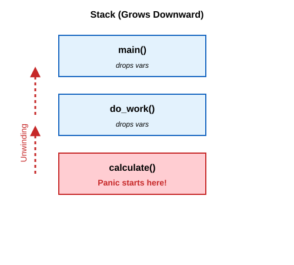

# Error handling

## 1. Overview

In TypeScript, error handling typically revolves around exceptions. You `throw` an `Error`, and somewhere up the call stack, a `try/catch` block hopefully catches it. If nothing catches it, the process crashes. 

Rust takes a radically different approach: **Rust does not have exceptions.** There is no `throw` and no `try/catch`. 

Instead, Rust groups errors into two clear categories:
1. **Unrecoverable errors** (bugs you can't or shouldn't recover from, like indexing out of bounds)
2. **Recoverable errors** (expected failure points, like a file not being found)

Rust's philosophy is to make error handling **explicit in the type system**. If a function can fail in a recoverable way, its return signature will force you to acknowledge and handle that possibility.

---

## 2. Unrecoverable Errors with `panic!`

When an unrecoverable error occurs, Rust calls the `panic!` macro. A panic is reserved for situations where the program has reached a corrupted state or a clear bug has occurred.

### What `panic!` Does
When `panic!` is invoked, the program:
1. Prints a helpful error message.
2. **Unwinds the stack** (by default).
3. Exits the process.

### Stack Unwinding vs. Aborting
**Unwinding** means Rust walks back up the call stack, function by function. As it exits each stack frame, it runs the `Drop` implementation (destructor) for every local variable to clean up resources (like freeing heap memory or closing file handles).

Internally, the call stack looks like this:




Unwinding is safe and prevents memory leaks, but it requires generating extra code and takes some time when a panic happens. 

If you want smaller binaries and don't care about cleaning up gracefully on panic (since the OS will reclaim all memory when the process dies anyway), you can switch to **aborting**. This instantly kills the process without unwinding.
Add this to your `Cargo.toml`:
```toml
[profile.release]
panic = 'abort'
```

### Backtraces
If you want to see the exact sequence of function calls that led to the panic, you can run your program with the `RUST_BACKTRACE` environment variable:
```bash
RUST_BACKTRACE=1 cargo run
```

### When Things Auto-Panic
Rust will automatically panic for you in certain situations to prevent undefined behavior:
- Array out-of-bounds access (`let x = arr[99];` when `arr` has 5 items).
- Calling `.unwrap()` on a `None` or an `Err` value.
- Integer overflow in debug builds (e.g., `255u8 + 1`).

---

## 3. Recoverable Errors with `Result<T, E>`

For predictable errors (network failures, invalid user input), Rust uses the `Result` enum.

```rust
enum Result<T, E> {
    Ok(T),
    Err(E),
}
```
- `T` is the type of the value returned on success.
- `E` is the type of the error returned on failure.

### TypeScript Analogy
The closest pattern in TypeScript is returning a discriminated union instead of throwing:
```typescript
type Result<T, E> = 
  | { success: true; data: T }
  | { success: false; error: E };
```
Just like TypeScript will complain if you try to access `result.data` without checking `result.success`, Rust's compiler forces you to check whether a `Result` is `Ok` or `Err` before you can access the inner `T` value.

### Using `match`
The most fundamental way to handle a `Result` is with a `match` expression:
```rust
use std::fs::File;

let file_result = File::open("hello.txt");

let file = match file_result {
    Ok(file) => file,
    Err(error) => {
        panic!("Failed to open file: {:?}", error);
    }
};
```

### Matching on Different Errors
The `Err` variant contains an error value that you can inspect and match on. For example, standard I/O operations return `std::io::Error`, which has a `.kind()` method returning an `ErrorKind` enum:

```rust
use std::fs::File;
use std::io::ErrorKind;

let file = match File::open("hello.txt") {
    Ok(f) => f,
    Err(error) => match error.kind() {
        ErrorKind::NotFound => match File::create("hello.txt") {
            Ok(fc) => fc,
            Err(e) => panic!("Problem creating the file: {:?}", e),
        },
        other_error => {
            panic!("Problem opening the file: {:?}", other_error);
        }
    },
};
```
This pattern lets you recover gracefully from specific failure modes (e.g., creating a file if it doesn't exist) while propagating or panicking on others.

### Key Methods on `Result`
Because `match` can be verbose, `Result` provides many helper methods. (Internally, these methods are just `match` statements wrapped up nicely!).

**Extracting values (Warning: Panics!)**
- `unwrap()`: Returns the `T` if `Ok`. Panics if `Err`. *Use only in prototyping or when you are 100% sure it will succeed.*
- `expect(msg)`: Like `unwrap()`, but lets you provide a custom panic message. Highly recommended over `unwrap()`.

**Extracting values safely**
- `unwrap_or(default)`: Returns the `T`, or the provided `default` value if `Err`.
- `unwrap_or_else(closure)`: Like `unwrap_or`, but computes the default lazily via a closure.
- `unwrap_or_default()`: Returns the type's `Default::default()` value on `Err`.

**Transforming Results**
- `map(closure)`: Transforms `Result<T, E>` into `Result<U, E>` by applying the closure to `T`.
- `map_err(closure)`: Transforms `Result<T, E>` into `Result<T, F>` by applying the closure to `E`.
- `and_then(closure)`: Chains operations that also return a `Result`. It transforms `Result<T, E>` into `Result<U, E>`. *This is exactly like TypeScript's `Promise.then()`!*
- `or(res)`, `or_else(closure)`: Fallback to another `Result` if the first one is an `Err`.
- `flatten()`: Converts `Result<Result<T, E>, E>` into `Result<T, E>`.

**Inspection and Conversion**
- `is_ok()`, `is_err()`: Returns a boolean indicating the variant.
- `ok()`: Converts `Result<T, E>` into `Option<T>` (the error is discarded).
- `err()`: Converts `Result<T, E>` into `Option<E>` (the success value is discarded).
- `as_ref()`, `as_mut()`: Converts `&Result<T, E>` to `Result<&T, &E>` (useful to inspect the value without consuming it).

---

## 4. The `?` Operator

When writing a function that calls other functions that might fail, you often want to **propagate** the error back to the caller, rather than handling it yourself.

In TypeScript, errors bubble up automatically until caught. In Rust, you must explicitly return them. The `?` operator is syntax sugar for this pattern.

```rust
use std::fs::File;
use std::io::{self, Read};

// Returns Result containing a String on success, or an io::Error on failure
fn read_username() -> Result<String, io::Error> {
    let mut file = File::open("hello.txt")?; // <-- ? Operator!
    let mut s = String::new();
    file.read_to_string(&mut s)?;            // <-- ? Operator!
    Ok(s)
}
```

### How `?` Works
If the value is `Ok(T)`, the `?` evaluates to the inner `T` and execution continues.
If the value is `Err(E)`, the `?` operator **immediately returns from the entire function**, passing the `Err` to the caller.

### TypeScript Analogy
The closest analogy is optional chaining (`?.`) combined with early returns.
```typescript
// TS concept roughly equivalent to `?` for Result
const file = open("hello.txt");
if (!file.success) return file.error;
```

### Type Conversion via `From::from`
Internally, `?` is incredibly powerful because it automatically calls the `From::from()` trait method on the error type. 
If your function returns a `CustomError`, and you use `?` on a function that returns an `io::Error`, Rust will automatically convert `io::Error` into `CustomError` (provided you implemented the `From` trait). This keeps error handling extremely ergonomic.

### Using `?` with `Option`
You can also use `?` on `Option<T>` values. If the value is `None`, the function will immediately return `None`. Note: You cannot mix `Result` and `Option` with `?` in the same function unless you explicitly convert one to the other.

### `?` in `main`
By default, `main` returns `()`. But you can change `main` to return a `Result` so you can use `?`:
```rust
use std::error::Error;
use std::fs::File;

fn main() -> Result<(), Box<dyn Error>> {
    let _f = File::open("hello.txt")?;
    Ok(())
}
```
`Box<dyn Error>` means "any kind of error".

---

## 5. When to `panic!` vs Return `Result`

### When to Panic
- **Prototyping:** When you just want to get code working quickly, use `.unwrap()` or `.expect()`.
- **Tests:** Panicking is exactly how tests fail in Rust.
- **You know more than the compiler:** If you have logic that guarantees an `Err` is impossible, but the compiler can't prove it, use `.unwrap()` or `.expect()`.

```rust
// Hardcoded valid IP. This cannot fail.
let ip: IpAddr = "127.0.0.1".parse().expect("Hardcoded IP should be valid");
```

### When to Return `Result`
- If failure is **expected** and the caller has a reasonable chance of recovering or at least reporting the failure gracefully.
- For most library code, always return `Result`. You don't want to crash the application of whoever is using your library!

### Creating Custom Types for Validation
Instead of constantly checking preconditions (like `if value < 1 || value > 100`) throughout your codebase, idiomatic Rust uses the type system to enforce invariants at creation time.

```rust
pub struct Guess {
    value: i32,
}

impl Guess {
    pub fn new(value: i32) -> Guess {
        if value < 1 || value > 100 {
            panic!("Guess value must be between 1 and 100, got {}.", value);
        }

        Guess { value }
    }

    // Getter function: caller can read value, but cannot modify it directly!
    pub fn value(&self) -> i32 {
        self.value
    }
}
```
By making `value` private and only constructible through `Guess::new()`, any function that accepts a `Guess` is guaranteed to receive a valid number between 1 and 100—no runtime assertions needed!

### Ecosystem Tools: `thiserror` and `anyhow`
When building real-world Rust applications, standardizing error types can be tedious. The community relies on two major crates:

- **`thiserror`**: Used in **libraries**. It provides a macro to easily derive custom error types, ensuring your library exposes specific, typed errors for callers to match on.
- **`anyhow`**: Used in **applications** (binaries). It provides an `anyhow::Result` type that makes it extremely easy to capture, chain, and report *any* kind of error without writing custom error enums for every function.

---

## References
file:///Users/codingsimba/.rustup/toolchains/stable-x86_64-apple-darwin/share/doc/rust/html/book/ch09-00-error-handling.html
file:///Users/codingsimba/.rustup/toolchains/stable-x86_64-apple-darwin/share/doc/rust/html/book/ch09-01-unrecoverable-errors-with-panic.html
file:///Users/codingsimba/.rustup/toolchains/stable-x86_64-apple-darwin/share/doc/rust/html/book/ch09-02-recoverable-errors-with-result.html
file:///Users/codingsimba/.rustup/toolchains/stable-x86_64-apple-darwin/share/doc/rust/html/book/ch09-03-to-panic-or-not-to-panic.html